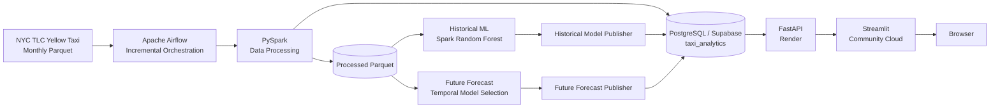
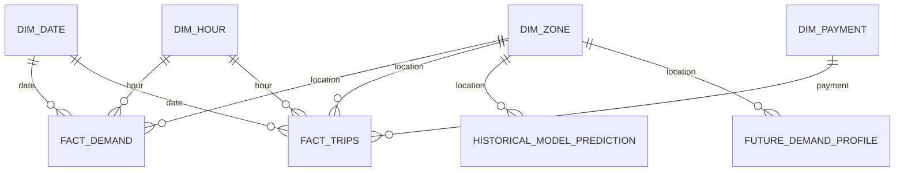

# 🚕 NYC Taxi Demand Forecasting & Business Analytics

An end-to-end data engineering, machine learning, and analytics project that transforms NYC Yellow Taxi data into demand forecasts, business insights, and an interactive cloud-deployed application.

🌐 **Live application:** https://george-nyc-taxi-analytics.streamlit.app/

## Overview

This project demonstrates a production-oriented analytics workflow across **data engineering, orchestration, analytical data modeling, machine learning, API serving, visualization, and cloud deployment**.

NYC TLC Yellow Taxi data is processed with PySpark and incrementally orchestrated with Apache Airflow. Analytical data and both historical/future model-serving snapshots are published to PostgreSQL/Supabase. FastAPI exposes the serving layer to a multi-page Streamlit application.

The currently validated data range is **January 2025 through May 2026**.

## Architecture



Offline PySpark handles large-scale transformations and model training. The deployed application never starts Spark for a user request.

Runtime path:

```text
Browser → Streamlit → FastAPI → Supabase PostgreSQL
```

## Incremental Data Pipeline

The Airflow DAG runs daily and checks only the next expected TLC month.

```text
Last successful month
        ↓
Check next TLC month
   ┌────┴───────────┐
Unavailable       Available
   ↓                 ↓
Successful no-op   Process month
                     ↓
                 Update DB
                     ↓
                 Retrain ML
                     ↓
       Publish historical + future snapshots
```

Operational behavior:

- processes at most one newly available month per scheduled run
- does not retrain when no new TLC month is available
- maintains pipeline state in PostgreSQL
- updates local PostgreSQL and production Supabase
- reruns the shared ML pipeline after successful ingestion
- publishes historical evaluation and future forecast snapshots automatically
- sends Slack notifications after successful retraining/publishing and on failures
- keeps normal daily no-op runs silent
- supports a separate manual backfill workflow

## Analytical Data Model

PostgreSQL uses the unified **`taxi_analytics`** schema.

Core analytical tables:

- `dim_zone`
- `dim_date`
- `dim_hour`
- `dim_payment`
- `fact_demand`
- `fact_trips`
- `pipeline_runs`

Historical model-serving tables:

- `historical_model_metric`
- `historical_feature_importance`
- `historical_model_prediction`

Future forecast-serving tables:

- `future_demand_profile`
- `future_model_metric`
- `future_forecast_metadata`

The future profile is keyed by **zone × month × weekday × hour**, allowing seasonality to be served without loading a Spark model at request time.



## Key Features

- Incremental NYC TLC monthly ingestion with Apache Airflow
- Large-scale transformation and feature engineering with PySpark
- Complete zone-hour demand panel including zero-demand observations
- PostgreSQL/Supabase dimensional analytical model
- Pipeline-state tracking for incremental processing
- Slack operational alerts
- Spark Random Forest for historical demand-model validation
- Database-backed historical metrics, feature importance and predictions
- Leakage-safe rolling future-month backtesting
- Automatic future production-model selection
- Forecast-safe calendar and historical aggregate features
- Database-backed long-horizon future demand inference
- Dynamic data-range discovery from PostgreSQL
- Revenue, payment, tip, distance, surcharge and zone-level business analytics
- REST API serving with FastAPI and SQLAlchemy
- Interactive multi-page Streamlit application with Plotly
- Cloud deployment with Supabase, Render and Streamlit Community Cloud

## 🔮 Demand Forecasting

The project intentionally separates **historical model evaluation** from **true future inference**.

### Historical Random Forest

The historical Spark Random Forest uses temporal, cyclical, lag and rolling-demand features, including 1-hour, 24-hour and 168-hour lags.

Latest validated historical retraining using data through May 2026:

| Model | MAE | RMSE |
|---|---:|---:|
| Persistence baseline | 6.51 | 21.84 |
| Random Forest | **4.63** | **15.97** |

Historical predictions, metrics and feature importance are published transactionally to local PostgreSQL and Supabase and served from the database.

### Future Forecast Model Selection

Arbitrary future dates cannot use unknown future observed lag values. The future pipeline therefore uses only predictors available at forecast time:

- hour, weekday, month and weekend indicator
- cyclical hour/weekday/month encodings
- historical zone mean demand
- historical zone-hour mean demand
- historical zone-weekday-hour mean demand
- categorical taxi-zone identity

During temporal backtesting, historical aggregate features are computed strictly from months before each holdout month to prevent leakage.

Four practical candidates are compared on the latest four available monthly holdouts:

1. `zone_dow_hour_mean` baseline
2. Linear Regression
3. Random Forest
4. Gradient-Boosted Trees

The production model is **selected automatically by lowest average MAE, with RMSE as tie-breaker**. The baseline is retained when complexity does not improve validation performance; an ML model is promoted only when it performs better.

After selection, the winner generates a month-aware future scoring profile across `LocationID × month × day_of_week × hour`. Future metrics, metadata and predictions are published directly to PostgreSQL/Supabase and served through `POST /predict`.

## 💼 Business Analytics

The business analytics layer complements demand forecasting with trip volume, fare and total revenue, tips, payment methods, trip distance, tolls, congestion-related charges, and borough/taxi-zone performance.

## Serving Strategy

Runtime serving is database-backed for demand analytics, business analytics, historical model evaluation and future forecasting. `data/app/zones.parquet` and `data/app/eda/` remain lightweight offline staging/EDA assets only.

## Tech Stack

| Area | Technologies |
|---|---|
| Data Processing | Python, Pandas, PySpark |
| Orchestration | Apache Airflow, Docker |
| Data Engineering | Parquet, incremental ingestion, feature pipelines |
| Database | PostgreSQL, Supabase |
| Machine Learning | Spark ML Linear Regression, Random Forest, GBT, temporal baselines |
| Backend | FastAPI, SQLAlchemy |
| Frontend | Streamlit, Plotly |
| Monitoring | Slack Incoming Webhooks |
| Deployment | Render, Streamlit Community Cloud, Supabase |
| Development | Git, GitHub |

## Project Structure

```text
airflow/
└── dags/                  # Scheduled monthly ingestion and manual backfill
backend/
├── serving/               # FastAPI application and schemas
├── sql/                   # PostgreSQL schema DDL
├── src/
│   ├── config/            # Backend settings
│   ├── database/          # Connections, loaders and query repositories
│   ├── features/          # Forecast feature engineering
│   ├── ingestion/         # Spark session, TLC availability and source ingestion
│   ├── ml/                # Historical/future ML and database publication
│   ├── persistence/       # Parquet helpers
│   └── processing/        # Data transformations and dataset construction
└── workflows/             # Shared data and ML orchestration
frontend/
├── config/                # Frontend API settings
├── pages/                 # Streamlit application pages
├── utils/                 # API, theme and report utilities
└── streamlit_app.py
```

## Cloud Deployment

```text
Streamlit Community Cloud
        ↓ HTTPS
Render FastAPI
        ↓
Supabase PostgreSQL
```

Streamlit communicates only with FastAPI and does not hold database credentials. The data range is obtained dynamically from FastAPI, so newly ingested months can automatically become available to DB-backed pages.

## Documentation

Detailed technical documentation is available under `docs/`: Architecture, Data Pipeline, Data Model, Forecasting, and Deployment & Operations.

## Live Demo

**Launch NYC Taxi Analytics:** https://george-nyc-taxi-analytics.streamlit.app/

> The backend is hosted on Render's free tier. The first request after inactivity may take some time while the service starts.
