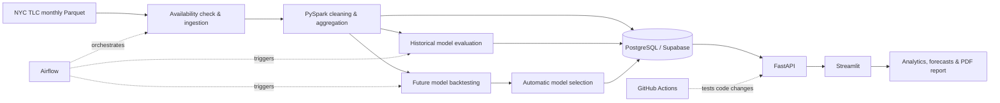

# NYC Yellow Taxi Demand Forecasting

An end-to-end analytics project for NYC Yellow Taxi demand: automated TLC ingestion, PySpark processing, PostgreSQL, machine learning, FastAPI, Streamlit and Airflow.

**Live app:** https://george-nyc-taxi-analytics.streamlit.app/

## End-to-End Process



1. Airflow checks whether the next TLC monthly file is available.
2. New trip data is ingested, cleaned and aggregated with PySpark.
3. Analytical tables are persisted to PostgreSQL and the hosted Supabase database.
4. Historical demand modelling evaluates prediction quality using observed-history features.
5. Future forecasting compares forecast-safe candidate models with rolling temporal backtests and selects the best validated model automatically.
6. Published analytics, metrics and forecasts are served by FastAPI.
7. Streamlit provides interactive analysis, future-demand forecasting and a downloadable project report.
8. GitHub Actions runs automated tests whenever application code changes.

## Local Execution

Run from the repository root and configure the required environment variables in `.env`.

```bash
# 1. Install dependencies
pip install -r requirements.txt

# 2. Build/process the analytical data
python -m backend.workflows.run_pipeline

# 3. Train, evaluate and publish ML outputs
python -m backend.workflows.ml_pipeline

# 4. Start FastAPI
uvicorn backend.serving.fast_api:app --reload

# 5. In a second terminal, start Streamlit
streamlit run frontend/Home.py

# 6. Run tests
pytest -q
```

## Documentation

- [Backend](docs/backend.md) — data model, processing, ML and API
- [Orchestration](docs/orchestration.md) — Airflow update workflow
- [Frontend](docs/frontend.md) — use cases, Streamlit UI and report download
- [Deployment](docs/deployment.md) — hosted architecture and CI

## Tech Stack

Python · PySpark · PostgreSQL · Supabase · Spark ML · FastAPI · Streamlit · Airflow · Docker · pytest · GitHub Actions
