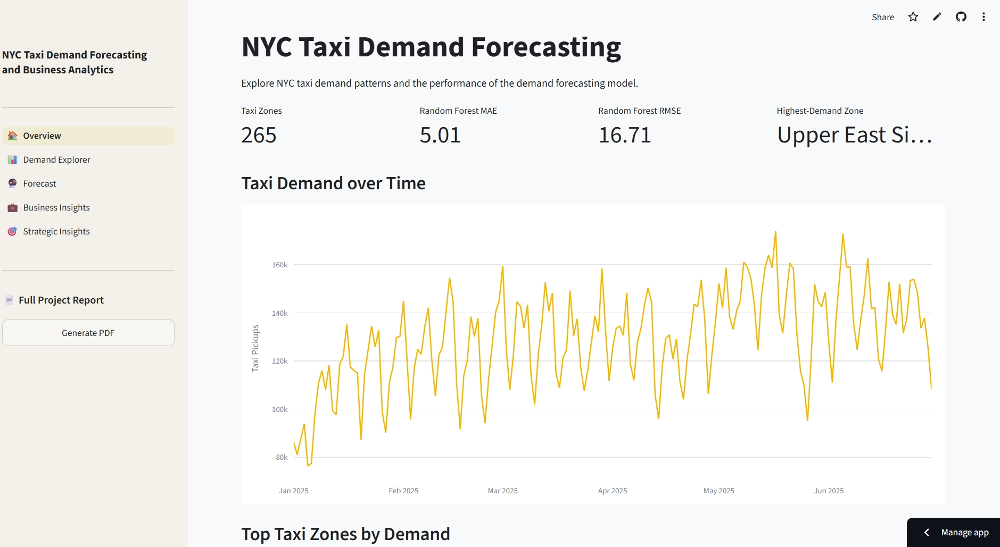
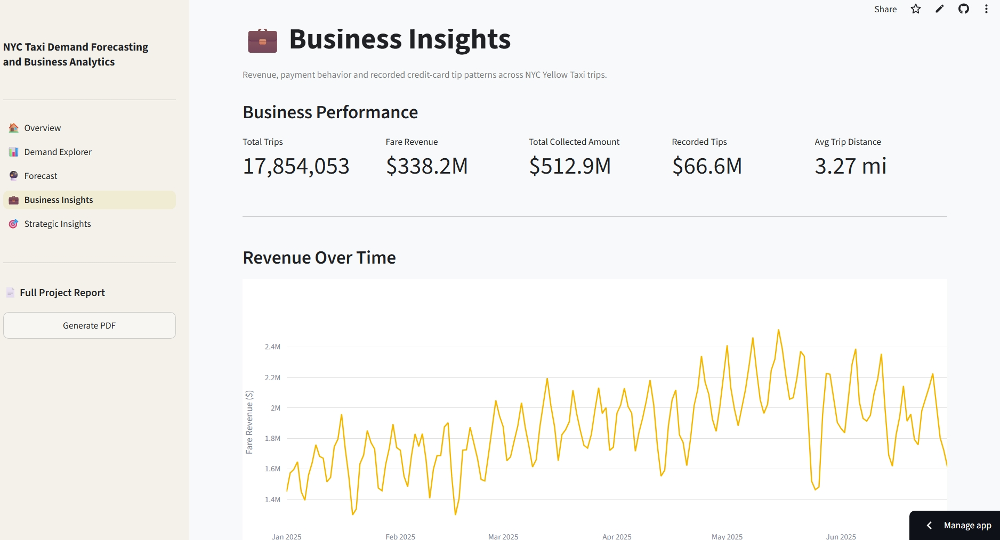
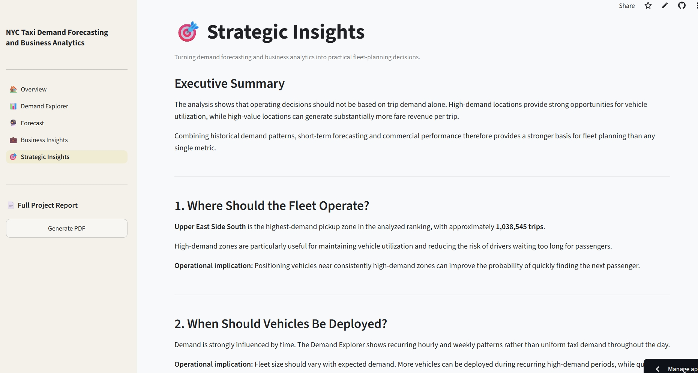

# 🚕 NYC Taxi Demand Forecasting & Business Analytics

End-to-end data platform for analyzing NYC Yellow Taxi demand, forecasting
future demand, and deriving operational and business insights.

🌐 **[Live Application](https://george-nyc-taxi-analytics.streamlit.app/)**

## Overview

This project demonstrates an end-to-end data workflow combining large-scale
data processing, analytical data modeling, machine learning, API-based serving,
interactive analytics, and cloud deployment.

*Interactive NYC Taxi analytics application — click the image to open the live app.*

## Architecture

NYC Taxi Data → PySpark → PostgreSQL → Machine Learning → FastAPI → Streamlit

**Production:** Supabase PostgreSQL → FastAPI on Render → Streamlit Community Cloud

## Key Features

- Large-scale taxi data processing with PySpark
- Demand-oriented and business-oriented relational data models
- Exploratory demand analysis and feature engineering
- Machine-learning demand forecasting
- Revenue, payment, and trip-value analytics
- REST API serving with FastAPI
- Interactive multi-page Streamlit application
- Cloud deployment with Supabase, Render, and Streamlit Community Cloud

### 🔮 Machine Learning Forecasting

The forecasting layer compares predicted hourly taxi demand with observed
demand across NYC taxi zones.

### 💼 Business Analytics

The business analytics layer complements demand forecasting with trip,
revenue, payment, tip, and trip-distance metrics.

### 🎯 From Analytics to Decisions

The final analytical layer combines demand patterns, forecasting, and
commercial performance to derive practical fleet-planning insights.

## Tech Stack

**Data Processing:** Python, Pandas, PySpark  
**Database:** PostgreSQL, Supabase  
**Machine Learning:** Scikit-learn  
**Backend:** FastAPI, SQLAlchemy  
**Frontend:** Streamlit, Plotly  
**Deployment:** Render, Streamlit Community Cloud  
**Development:** Git, GitHub

## Documentation

Detailed technical documentation:

- [Architecture](docs/architecture.md)
- [Data Pipeline](docs/data_pipeline.md)
- [Data Model](docs/data_model.md)
- [Forecasting](docs/forecasting.md)
- [Deployment](docs/deployment.md)

## Live Demo

👉 **[Launch NYC Taxi Analytics](https://george-nyc-taxi-analytics.streamlit.app/)**

> The backend is hosted on Render's free tier. The first request after a period
> of inactivity may take approximately 50 seconds while the service starts.
