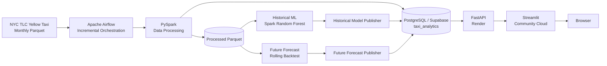
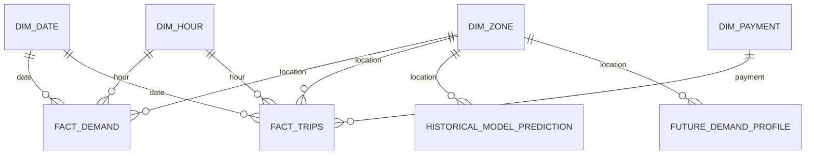

# 🚕 NYC Taxi Demand Forecasting & Business Analytics

An end-to-end data engineering, machine learning, and analytics project that transforms NYC Yellow Taxi data into demand forecasts, business insights, and an interactive cloud-deployed application.

🌐 **Live application:** https://george-nyc-taxi-analytics.streamlit.app/

## Overview

This project demonstrates a production-oriented analytics workflow across **data engineering, orchestration, analytical data modeling, machine learning, API serving, visualization, and cloud deployment**.

NYC TLC Yellow Taxi data is processed with PySpark and incrementally orchestrated with Apache Airflow. Analytical data and both historical/future model-serving snapshots are published to PostgreSQL/Supabase. FastAPI exposes the serving layer to a multi-page Streamlit application.

The currently validated data range is **January 2025 through May 2026**.

## Architecture



The project deliberately separates **offline processing and ML** from **runtime serving**. PySpark handles large-scale transformations and training offline. The deployed application never starts Spark for a user request.

Runtime path:

```text
Browser → Streamlit → FastAPI → Supabase PostgreSQL
```

## Incremental Data Pipeline

The main Airflow DAG runs daily and checks only the next expected TLC month.

```text
Last successful month
        ↓
Check next TLC month
   ┌────┴───────────┐
Unavailable       Available
   ↓                 ↓
Successful no-op   Process month
                     ↓
                 Update DB
                     ↓
                 Retrain ML
                     ↓
       Publish historical + future snapshots
```

Key operational behavior:

- processes at most one newly available month per scheduled run
- does not retrain when no new TLC month is available
- maintains pipeline state in PostgreSQL
- updates local PostgreSQL and production Supabase
- reruns the shared ML pipeline after successful ingestion
- publishes historical evaluation and future forecast snapshots automatically
- sends Slack notifications after successful retraining/publishing and on pipeline/task failures
- keeps normal daily no-op runs silent when no new TLC month is available
- supports a separate manual backfill workflow for controlled catch-up processing

## Analytical Data Model

PostgreSQL uses the unified **`taxi_analytics`** schema.

Core analytical tables:

- `dim_zone`
- `dim_date`
- `dim_hour`
- `dim_payment`
- `fact_demand`
- `fact_trips`
- `pipeline_runs`

Historical model-serving tables:

- `historical_model_metric`
- `historical_feature_importance`
- `historical_model_prediction`

Future forecast-serving tables:

- `future_demand_profile`
- `future_model_metric`
- `future_forecast_metadata`



The database is an analytical/serving model rather than a raw trip store. The full schema is documented in `docs/data_model.md`.

## Key Features

- Incremental NYC TLC monthly ingestion with Apache Airflow
- Large-scale transformation and feature engineering with PySpark
- Complete zone-hour demand panel including zero-demand observations
- PostgreSQL/Supabase dimensional analytical model
- Pipeline-state tracking for incremental processing
- Slack operational alerts for retraining success and pipeline failures
- Spark Random Forest for historical demand-model validation
- Database-backed historical metrics, feature importance and predictions
- Rolling future-month backtesting for production model selection
- Database-backed long-horizon future demand inference
- Dynamic data-range discovery from PostgreSQL
- Revenue, payment, tip, distance, surcharge and zone-level business analytics
- REST API serving with FastAPI and SQLAlchemy
- Interactive multi-page Streamlit application with Plotly
- Cloud deployment with Supabase, Render and Streamlit Community Cloud

## 🔮 Demand Forecasting

The project intentionally separates **historical model evaluation** from **future inference**.

### Historical Random Forest

The Spark Random Forest uses temporal, cyclical, lag and rolling-demand features, including 1-hour, 24-hour and 168-hour lags.

Latest validated historical retraining using data through May 2026:

| Model | MAE | RMSE |
|---|---:|---:|
| Persistence baseline | 6.51 | 21.84 |
| Random Forest | **4.63** | **15.97** |

Historical predictions, metrics and feature importance are published transactionally to local PostgreSQL and Supabase after retraining and served by FastAPI from the database.

### Production Future Forecast

Arbitrary future dates cannot rely on unknown future lag values. The project therefore evaluates a separate long-horizon forecasting approach with rolling future-month backtests.

Aggregate validation across February–May 2026:

| Model | MAE | RMSE |
|---|---:|---:|
| `zone_dow_hour_mean` | **6.4030** | **16.0399** |
| Random Forest | 7.3245 | 19.7391 |

The simpler `zone_dow_hour_mean` model outperformed the future Random Forest and is therefore the **production future model**. Future profiles, metrics and metadata are published directly to PostgreSQL/Supabase and served by FastAPI through `POST /predict`.

## 💼 Business Analytics

The business analytics layer complements demand forecasting with commercial and operational measures including trip volume, fare and total revenue, tips, payment methods, trip distance, tolls, congestion-related charges, and borough/taxi-zone performance.

## Serving Strategy

Runtime serving is now database-backed for:

- demand analytics
- business analytics
- dynamic data coverage
- historical model predictions
- historical model metrics
- historical feature importance
- future forecast profiles
- future model metrics and metadata

`data/app/zones.parquet` and `data/app/eda/` remain lightweight offline staging/EDA assets; they are not the source of historical model-serving results.

## Tech Stack

| Area | Technologies |
|---|---|
| Data Processing | Python, Pandas, PySpark |
| Orchestration | Apache Airflow, Docker |
| Data Engineering | Parquet, incremental ingestion, feature pipelines |
| Database | PostgreSQL, Supabase |
| Machine Learning | Spark ML Random Forest, temporal profile forecasting |
| Backend | FastAPI, SQLAlchemy |
| Frontend | Streamlit, Plotly |
| Monitoring | Slack Incoming Webhooks |
| Deployment | Render, Streamlit Community Cloud, Supabase |
| Development | Git, GitHub |

## Project Structure

```text
airflow/
└── dags/                  # Scheduled monthly ingestion and manual backfill
backend/
├── serving/               # FastAPI application and schemas
├── sql/                   # PostgreSQL schema DDL
├── src/
│   ├── config/            # Backend settings
│   ├── database/          # Connections, loaders and query repositories
│   ├── features/          # Historical forecast feature engineering
│   ├── ingestion/         # Spark session, TLC availability and source ingestion
│   ├── ml/                # Historical/future ML and database publication
│   ├── persistence/       # Parquet helpers
│   └── processing/        # Data transformations and dataset construction
└── workflows/             # Shared data and ML orchestration
frontend/
├── config/                # Frontend API settings
├── pages/                 # Streamlit application pages
├── utils/                 # API, theme and report utilities
└── streamlit_app.py
```

## Cloud Deployment

```text
Streamlit Community Cloud
        ↓ HTTPS
Render FastAPI
        ↓
Supabase PostgreSQL
```

Streamlit communicates only with FastAPI and does not hold database credentials. Render reads analytical data plus historical and future model-serving snapshots from Supabase.

The current demand-data range is obtained dynamically from FastAPI rather than being hard-coded in the frontend, so newly loaded months can automatically become available to DB-backed Streamlit pages.

## Documentation

Detailed technical documentation is available under `docs/`: Architecture, Data Pipeline, Data Model, Forecasting, and Deployment & Operations.

## Live Demo

**Launch NYC Taxi Analytics:** https://george-nyc-taxi-analytics.streamlit.app/

> The backend is hosted on Render's free tier. The first request after a period of inactivity may take some time while the service starts.
