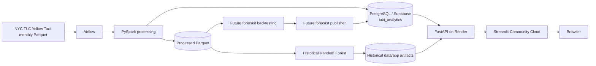
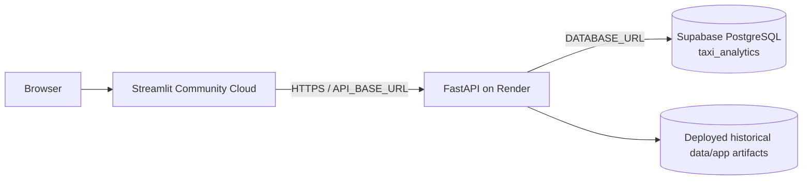

# System architecture

## Scope

This project is an end-to-end NYC Yellow Taxi analytics and forecasting system. It separates offline data/ML processing from lightweight runtime serving.

The current validated data range is **January 2025 through May 2026**.

The architecture has four main parts:

1. **Data ingestion and processing** with PySpark
2. **ML training and future-demand profile generation**
3. **Analytical and serving storage** in PostgreSQL / Supabase plus selected file-based artifacts
4. **Runtime serving** with FastAPI on Render and Streamlit Community Cloud

PySpark is intentionally kept out of request-time serving. FastAPI never starts Spark and Streamlit never talks directly to PostgreSQL or Supabase.

## End-to-end architecture



## Airflow orchestration

Airflow runs locally in Docker with a dedicated metadata PostgreSQL database. That Airflow metadata database is separate from both the local NYC Taxi development database and Supabase.

The main scheduled DAG is:

`airflow/dags/nyc_taxi_monthly_ingestion.py`

Normal operation:

- schedule: daily
- `catchup=False`
- `max_active_runs=1`
- checks only the next expected TLC month
- processes at most one newly available month per run
- succeeds as a no-op when the next TLC month is not yet available
- retrains ML only after a new month is successfully processed

The shared ML workflow is implemented in `backend/workflows/ml_pipeline.py` and runs:

```text
Historical Random Forest training
        ↓
Historical app artifact preparation
        ↓
Future-model rolling backtest
        ↓
Future forecast profile publication
        ↓
Local PostgreSQL + Supabase
```

## Implementation layers

| Layer | Repository location | Responsibility |
|---|---|---|
| Configuration | `backend/src/config/`, `frontend/config/` | Paths, database URLs, API configuration |
| Ingestion | `backend/src/ingestion/` | Spark session, TLC availability, source loading |
| Processing | `backend/src/processing/` | Dataset construction and transformations |
| Features | `backend/src/features/` | Historical demand feature engineering |
| Persistence | `backend/src/persistence/` | Parquet persistence helpers |
| Database | `backend/src/database/` | SQLAlchemy connection, loaders, serving repositories |
| ML | `backend/src/ml/` | Historical model, future backtesting, profile publication |
| Workflows | `backend/workflows/` | Data and ML orchestration |
| Airflow | `airflow/dags/` | Scheduled and manual orchestration |
| Serving | `backend/serving/` | FastAPI application and schemas |
| Frontend | `frontend/` | Streamlit application and HTTP API client |

## Persistence layers

| Layer | Location/system | Purpose |
|---|---|---|
| Raw | `data/raw/` | Monthly TLC trip files and taxi-zone lookup |
| Processed | `data/processed/` | Features, business data, model outputs, backtest results, persisted historical model |
| Historical app artifacts | `data/app/` | Historical predictions, metrics, feature importance, zones and EDA extracts |
| Local PostgreSQL | local development DB | Local analytical and future-forecast publication target |
| Supabase PostgreSQL | production DB | Production analytical data and future forecast serving data |

The historical `data/app` artifacts remain intentionally file-based. They are small enough for deployment and avoiding an unnecessary migration keeps Supabase storage usage lower.

Future forecast artifacts are **not** stored under `data/app/future_forecast/`. The future serving layer is database-backed.

## PostgreSQL model

The production schema is `taxi_analytics`.

Core analytical tables:

- `dim_zone`
- `dim_date`
- `dim_hour`
- `dim_payment`
- `fact_demand`
- `fact_trips`
- `pipeline_runs`

Future forecast serving tables:

- `future_demand_profile`
- `future_model_metric`
- `future_forecast_metadata`

The future forecast publisher replaces the future-serving snapshot transactionally in both local PostgreSQL and Supabase.

## Runtime serving plane

### FastAPI

`backend/serving/fast_api.py` serves:

- PostgreSQL-backed demand analytics
- PostgreSQL-backed business analytics
- PostgreSQL-backed future forecast metrics and predictions
- file-backed historical model predictions, historical metrics and feature importance

The `/predict` endpoint is a POST endpoint and performs lightweight lookup/fallback logic against the published future-demand profiles. No Spark or scikit-learn model is loaded for the request.

### Streamlit

The Streamlit app provides:

- Overview
- Demand Explorer
- Forecast
- Business Insights
- Strategic Insights

Streamlit calls FastAPI through `API_BASE_URL`. It does not need database credentials.

## Cloud production topology



Current production components:

- Streamlit Community Cloud: frontend
- Render: FastAPI backend
- Supabase: production PostgreSQL
- Airflow: local Docker orchestration for now

## Key architectural decisions

### Spark stays offline

Spark handles data-scale transformation and training. Runtime services remain lightweight and inexpensive to host.

### Separate historical evaluation from future inference

The historical Random Forest is retained for model validation and short-horizon evaluation. It is not used as the long-horizon production model.

For future forecasts, rolling backtests showed that the simpler `zone_dow_hour_mean` profile model outperformed the Random Forest across the validated future months, so it is the production future model.

### Future serving is database-backed

Future profiles, metrics and metadata are published to PostgreSQL/Supabase and read by FastAPI. This removes the need to redeploy future forecast files after every retraining.

### Historical artifacts remain file-based

Historical predictions, model metrics, feature importance and zones remain under `data/app/`. After a successful retraining, these files must be reviewed, committed and deployed manually if they changed.

### Data freshness and model freshness are separate

DB-backed analytics become current after a successful monthly data load. Model-backed outputs become current only after the ML pipeline completes; historical file-backed outputs additionally require the refreshed `data/app` files to be committed and deployed.

For more detail, see [Data pipeline](data_pipeline.md), [Data model](data_model.md), [Forecasting](forecasting.md), and [Deployment](deployment.md).
