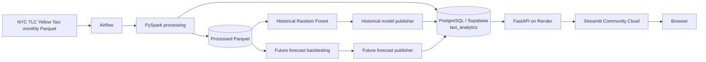
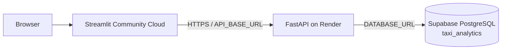

# System architecture

## Scope

This project is an end-to-end NYC Yellow Taxi analytics and forecasting system. It separates offline data/ML processing from lightweight runtime serving.

The current validated data range is **January 2025 through May 2026**.

The architecture has four main parts:

1. **Data ingestion and processing** with PySpark
2. **ML training, validation and serving-snapshot publication**
3. **Analytical and model-serving storage** in PostgreSQL / Supabase
4. **Runtime serving** with FastAPI on Render and Streamlit Community Cloud

PySpark is intentionally kept out of request-time serving. FastAPI never starts Spark and Streamlit never talks directly to PostgreSQL or Supabase.

## End-to-end architecture



## Airflow orchestration

Airflow runs locally in Docker with a dedicated metadata PostgreSQL database. That Airflow metadata database is separate from both the local NYC Taxi development database and Supabase.

The main scheduled DAG is `airflow/dags/nyc_taxi_monthly_ingestion.py`.

Normal operation:

- schedule: daily
- `catchup=False`
- `max_active_runs=1`
- checks only the next expected TLC month
- processes at most one newly available month per run
- succeeds as a no-op when the next TLC month is not yet available
- retrains ML only after a new month is successfully processed
- publishes both historical evaluation and future forecast snapshots automatically

The shared ML workflow in `backend/workflows/ml_pipeline.py` runs:

```text
Historical Random Forest training
        ↓
Historical model publication
        ↓
Future-model rolling backtest
        ↓
Future forecast publication
        ↓
Local PostgreSQL + Supabase
```

## Implementation layers

| Layer | Repository location | Responsibility |
|---|---|---|
| Configuration | `backend/src/config/`, `frontend/config/` | Paths, database URLs, API configuration |
| Ingestion | `backend/src/ingestion/` | Spark session, TLC availability, source loading |
| Processing | `backend/src/processing/` | Dataset construction and transformations |
| Features | `backend/src/features/` | Historical demand feature engineering |
| Persistence | `backend/src/persistence/` | Parquet persistence helpers |
| Database | `backend/src/database/` | SQLAlchemy connection, loaders, serving repositories |
| ML | `backend/src/ml/` | Historical model, future backtesting and DB publication |
| Workflows | `backend/workflows/` | Data and ML orchestration |
| Airflow | `airflow/dags/` | Scheduled and manual orchestration |
| Serving | `backend/serving/` | FastAPI application and schemas |
| Frontend | `frontend/` | Streamlit application and HTTP API client |

## Persistence layers

| Layer | Location/system | Purpose |
|---|---|---|
| Raw | `data/raw/` | Monthly TLC trip files and taxi-zone lookup |
| Processed | `data/processed/` | Features, model outputs, business data and backtest results |
| App staging | `data/app/` | Lightweight taxi-zone and EDA assets only |
| Local PostgreSQL | local development DB | Local analytical and model-publication target |
| Supabase PostgreSQL | production DB | Production analytical and model-serving data |

Historical model predictions, metrics and feature importance are no longer runtime files under `data/app/`; they are published to PostgreSQL/Supabase.

## PostgreSQL model

The production schema is `taxi_analytics`.

Core analytical tables:

- `dim_zone`
- `dim_date`
- `dim_hour`
- `dim_payment`
- `fact_demand`
- `fact_trips`
- `pipeline_runs`

Historical model-serving tables:

- `historical_model_metric`
- `historical_feature_importance`
- `historical_model_prediction`

Future forecast-serving tables:

- `future_demand_profile`
- `future_model_metric`
- `future_forecast_metadata`

Both publishers replace their serving snapshots transactionally in local PostgreSQL and, when configured, Supabase.

## Runtime serving plane

### FastAPI

`backend/serving/fast_api.py` serves PostgreSQL-backed demand/business analytics, historical model evaluation and future forecast inference. Historical `/metrics`, `/feature-importance` and `/predictions/{location_id}` queries are database-backed.

The `/predict` endpoint performs lightweight lookup/fallback logic against published future-demand profiles. No Spark model is loaded for a request.

### Streamlit

The Streamlit app provides Overview, Demand Explorer, Forecast, Business Insights and Strategic Insights. Streamlit calls FastAPI through `API_BASE_URL` and does not need database credentials.

## Cloud production topology



Current production components:

- Streamlit Community Cloud: frontend
- Render: FastAPI backend
- Supabase: production PostgreSQL analytical/model-serving store
- Airflow: local Docker orchestration for now

## Key architectural decisions

### Spark stays offline

Spark handles data-scale transformation and training. Runtime services remain lightweight and inexpensive to host.

### Separate historical evaluation from future inference

The historical Random Forest is retained for model validation and short-horizon evaluation. It is not used as the long-horizon production model. Rolling future backtests currently select `zone_dow_hour_mean` for long-horizon production forecasting.

### Model serving is database-backed

Historical predictions/metrics/feature importance and future profiles/metrics/metadata are published to PostgreSQL/Supabase and read by FastAPI. Monthly retraining therefore does not require committing model-serving artifacts to Git.

### Data freshness and model freshness remain separate

DB-backed analytics become current after successful monthly data loading. Model-backed outputs become current after the ML training and publication stages complete successfully.

For more detail, see [Data pipeline](data_pipeline.md), [Data model](data_model.md), [Forecasting](forecasting.md), and [Deployment](deployment.md).
