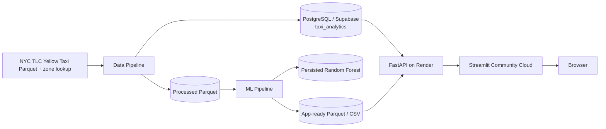
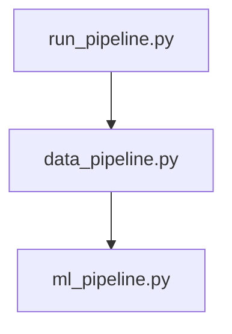
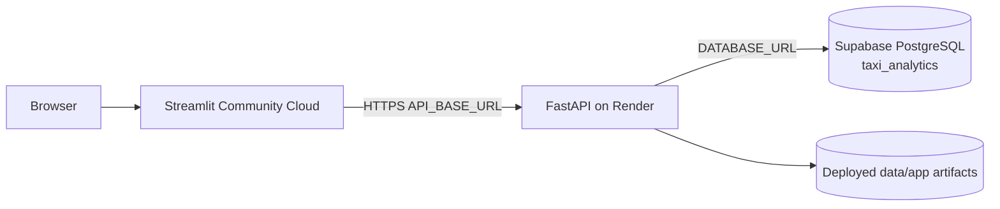

# System architecture

## Scope

This project is an analytical application for NYC Yellow Taxi pickup demand,
forecast evaluation, and trip-business analysis. It separates offline processing
from runtime serving:

- an **offline data and machine-learning plane**, implemented primarily with
  PySpark, that prepares January–June 2025 taxi data, analytical tables, model
  outputs, and app-ready artifacts; and
- a **runtime serving plane**, implemented with FastAPI, PostgreSQL, Pandas,
  and Streamlit.

PySpark is not part of either deployed web process. FastAPI does not retrain
the model or invoke Spark for requests; it serves PostgreSQL-backed analytics
and precomputed model results.

## End-to-end view

## Pipeline orchestration

Implementation code lives under `backend/src/`. The `backend/workflows/`
package is reserved for orchestration and contains only:

- `data_pipeline.py`
- `ml_pipeline.py`
- `run_pipeline.py`

`data_pipeline.py` coordinates dataset construction, business-trip construction,
EDA-serving data preparation, reset of the analytical schema contents, demand
table loading, and business table loading.

`ml_pipeline.py` coordinates Random Forest training and app-artifact
publication.

`run_pipeline.py` is the top-level orchestrator and runs the data pipeline
followed by the ML pipeline.

There is no external scheduler, DAG platform, or CI/CD workflow in the
repository.

## Implementation layers

| Layer | Repository location | Responsibility |
|---|---|---|
| Configuration | `backend/src/config/` | Backend paths, database URL, canonical schema |
| Ingestion | `backend/src/ingestion/` | Spark session, trip input, zone lookup |
| Processing | `backend/src/processing/` | Dataset construction, EDA preparation, trip transformations |
| Features | `backend/src/features/` | Demand feature engineering |
| Persistence | `backend/src/persistence/` | Parquet persistence helpers |
| Database | `backend/src/database/` | SQLAlchemy connection, loaders, query repositories |
| ML | `backend/src/ml/` | Model training and app-artifact publication |
| Workflows | `backend/workflows/` | Data, ML, and top-level orchestration only |
| Serving | `backend/serving/` | FastAPI application and response schemas |
| Frontend | `frontend/` | Streamlit application and HTTP API client |

Configuration is centralized in:

- `backend/src/config/settings.py`
- `frontend/config/settings.py`
- `backend/src/ingestion/spark_session.py`

## Persistence layers

| Layer | Location/system | Purpose |
|---|---|---|
| Raw | `data/raw/` | Monthly TLC trip files and taxi-zone lookup |
| Processed | `data/processed/` | Spark intermediates, features, predictions, model metrics, feature importance, persisted model |
| App artifacts | `data/app/` | Predictions, metrics, feature importance, zones, and EDA serving extract |
| Analytical database | PostgreSQL / Supabase | Unified `taxi_analytics` analytical schema |

The physical schema is defined in
`backend/sql/create_taxi_analytics_schema.sql`.

## Unified PostgreSQL model

The application uses one PostgreSQL schema: `taxi_analytics`.

It contains:

- `dim_zone`
- `dim_date`
- `dim_hour`
- `dim_payment`
- `fact_demand`
- `fact_trips`

Demand and business analytics share common dimensions while keeping separate
facts for their different analytical grains.

## Runtime serving plane

### FastAPI

`backend/serving/fast_api.py` serves PostgreSQL-backed demand analytics,
PostgreSQL-backed business analytics, and file-backed predictions, model
metrics, and feature importance.

### Streamlit

The Streamlit application provides Overview, Demand Explorer, Forecast,
Business Insights, and Strategic Insights pages. It communicates with FastAPI
over HTTP and does not connect directly to PostgreSQL or import Spark.

## Cloud production architecture

Render, Supabase, and Streamlit settings are managed on their respective
platforms. Infrastructure-as-code and automated deployment are outside the
repository.

## Architectural decisions and trade-offs

### Keep Spark outside request handling

Spark performs raw-scale transformations and model training offline. Runtime
services consume reduced files and analytical database tables.

### Precompute evaluation predictions

The API serves held-out June 2025 predictions rather than performing online
inference. This keeps serving lightweight, but results change only after the
offline ML pipeline is rerun and refreshed artifacts are deployed.

### Unified analytical schema

The earlier split between demand and business schemas has been replaced by one
`taxi_analytics` schema. Shared dimensions reduce duplication while separate
facts preserve their different grains.

### Thin workflow layer

Implementation modules remain reusable under `backend/src/`; workflow files
only express orchestration.

For more detail, see [Data pipeline](data_pipeline.md),
[Data model](data_model.md), [Forecasting](forecasting.md), and
[Deployment](deployment.md).
