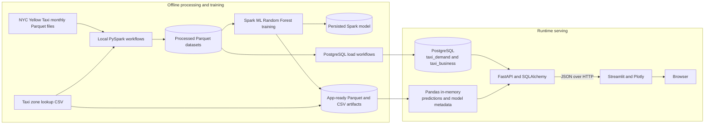
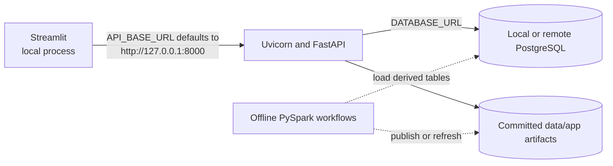
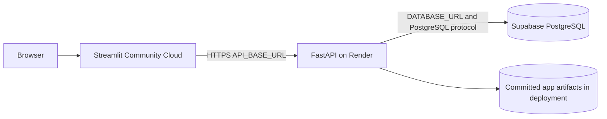

# System architecture

## Scope

This project is an analytical application for NYC Yellow Taxi pickup demand,
forecast evaluation, and trip-business analysis. Its architecture has two
deliberately separate planes:

- an **offline data and machine-learning plane**, implemented primarily with
  PySpark, that transforms January–June 2025 trip files and publishes derived
  data; and
- a **runtime serving plane**, implemented with FastAPI, PostgreSQL, Pandas,
  and Streamlit, that reads already-prepared results.

PySpark is not part of either deployed web process. The API does not retrain or
run the persisted Spark model when it receives a request; it serves precomputed
June 2025 predictions from Parquet.

## End-to-end view

The diagram shows data dependencies, not an automated orchestration graph.
The repository provides executable Python workflows but no scheduler, DAG, or
CI pipeline that chains them.

## Offline data and training plane

The batch workflows use a Spark session configured for `local[*]`, an 8 GiB
driver, and 200 shuffle partitions. They expect six-month raw data locally
under `data/raw/`; only the zone lookup is committed because raw monthly trip
Parquet is ignored by Git.

The demand path cleans trips, counts pickups by taxi zone and hour, constructs
a complete zone-hour panel, and adds temporal history features. The training
workflow then fits a Spark ML Random Forest on observations before June 2025
and evaluates it on June. Its main outputs are a Spark model and prediction
Parquet under the ignored `data/processed/` hierarchy.

Separate publication workflows produce compact files under `data/app/` and
load analytical tables into PostgreSQL. These outputs—not Spark DataFrames—are
the boundary between batch processing and serving. See [Data pipeline](data_pipeline.md)
and [Forecasting](forecasting.md) for detailed lineage.

The business path reuses the general trip cleaning, applies financial and
plausibility filters, and aggregates trip measures at pickup-zone, date, hour,
and payment-type grain before loading PostgreSQL.

## Persistence layers

| Layer | Repository location or system | Purpose | Runtime use |
|---|---|---|---|
| Raw | `data/raw/` | Monthly TLC trip files and taxi-zone lookup | None |
| Processed | `data/processed/` | Spark Parquet intermediates, predictions, feature importance, and saved model | None; ignored by Git |
| App artifacts | `data/app/` | Enriched predictions, metrics, feature importance, zones, and the PostgreSQL demand-source extract | Predictions and model metadata are read by FastAPI |
| Analytical database | PostgreSQL | Demand star model and aggregated business measures | Queried by FastAPI through SQLAlchemy |

The committed `data/app/eda/zone_hour_daily.parquet` is a staging source for
the demand database loader, not a file read by the API. Conversely,
`predictions.parquet`, `model_metrics.csv`, and `feature_importance.csv` are
loaded into Pandas when the FastAPI module starts.

## Runtime serving plane

### FastAPI backend

`backend/serving/fast_api.py` exposes three categories of data:

1. **PostgreSQL-backed demand analytics:** zones, hourly and weekday demand,
   daily trends, top zones, and zone-specific variants.
2. **PostgreSQL-backed business analytics:** summary totals, revenue trends,
   revenue by zone, payment mix, and credit-card tip analysis.
3. **File-backed ML results:** held-out predictions, aggregate model metrics,
   and feature importance.

Pydantic response models define the public JSON shape. SQLAlchemy repository
functions use parameterized text queries and convert database numeric values
where needed. The backend requires `DATABASE_URL` during import, even for
file-backed endpoints, because the database engine is created at module load.

### Streamlit frontend

The five-page Streamlit application provides Overview, Demand Explorer,
Forecast, Business Insights, and Strategic Insights views, plus a generated
PDF report. Its API client uses `requests` and an `API_BASE_URL`; it neither
opens a database connection nor imports Spark. Plotly and Streamlit perform
interactive presentation and limited client-side calculations over API
responses, such as selected-zone error summaries.

## Local development architecture

Local execution is a multi-process architecture:

The PostgreSQL host may be local or remote; the code only requires a valid
SQLAlchemy PostgreSQL URL. Database schemas and tables must already exist,
because the repository contains loaders but no schema migrations or complete
DDL.

## Cloud production architecture

The documented production topology is:

This topology is supported by the separate frontend/backend dependency files
and environment-variable boundaries. It is described in the README, but the
repository does not include Render infrastructure configuration, Supabase
migrations, Dockerfiles, or deployment automation. Accordingly, the diagram
documents the deployed service relationship rather than a reproducible
infrastructure-as-code specification. See [Deployment](deployment.md).

## Architectural decisions and trade-offs

### Keep distributed processing out of request handling

Spark is appropriate for the approximately 24 million raw records reported in
the exploratory notebooks, but its JVM startup and distributed abstractions
would be costly in small web processes. Publishing compact Parquet files and
database aggregates keeps the Render and Streamlit dependencies smaller and
request behavior simpler. The trade-off is that data and forecasts remain
static until the offline workflows are rerun and outputs redeployed/reloaded.

### Precompute evaluation predictions

Serving a June prediction table avoids rebuilding lags and rolling windows per
request and supports fast filtering by zone and date. It also means the
`/predictions/{location_id}` route is a historical held-out-results endpoint,
not general online inference or a future forecast service.

### Query analytical aggregates from PostgreSQL

Demand and business charts are calculated from serving facts with SQL rather
than maintaining a file per visualization. This centralizes aggregation and
supports date filters without rebuilding artifacts. It also makes database
availability a startup and runtime dependency of the API.

### Use separate facts for separate analytical grains

`taxi_demand.fact_demand` represents zone-date-hour demand, including zeros.
`taxi_business.fact_trips` represents additive measures by zone-date-hour and
payment type. This prevents financial analysis from being forced into the ML
feature table while allowing both domains to share zone metadata. Details are
in [Data model](data_model.md).

## Current scope

The implemented architecture focuses on reproducible local data processing and
a lightweight analytical serving stack. Workflow scheduling, database DDL,
cloud infrastructure configuration, and CI/CD are managed outside this
repository. FastAPI serves batch prediction results rather than loading the
model for online inference. The concrete handoff for metrics and feature
importance is described in
[Forecasting](forecasting.md#artifact-publication-boundary).
