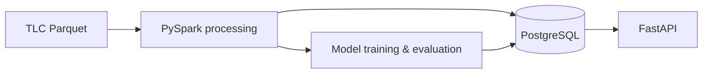
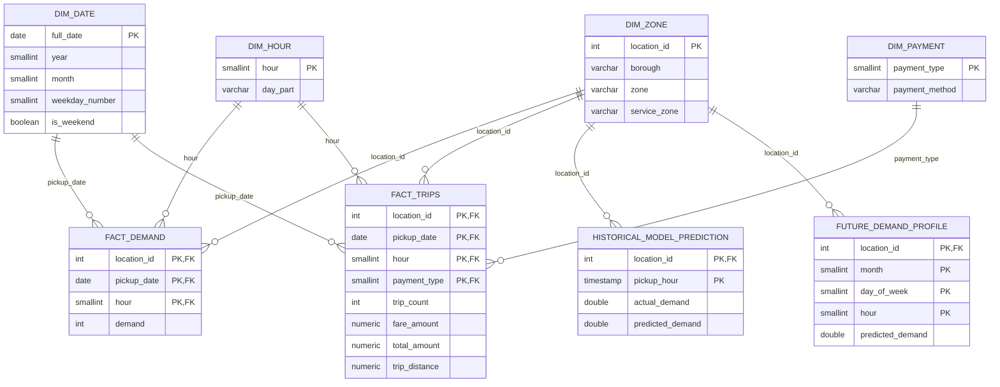

# Backend

The backend owns data processing, persistence, modelling and API serving.

## Data Flow

Monthly TLC files are cleaned and aggregated with PySpark. PostgreSQL stores analytics and published model outputs so neither FastAPI nor Streamlit needs to run Spark during user requests.

## Data Model

The analytical schema uses dimensions for zone, date, hour and payment method; facts hold aggregated demand and trip measures. Model-serving tables are linked to taxi zones where appropriate.

Operational/model metadata tables (`pipeline_runs`, model metrics, feature importance and forecast metadata) are intentionally omitted from the ERD to keep the analytical relationships readable.

## Modelling

**Historical evaluation** may use calendar, lag and rolling-demand features because previous observed demand is available. A persistence baseline and Random Forest are evaluated with a time-based holdout.

**Future forecasting** cannot use unknown future demand. It uses calendar features and historical demand profiles only. A profile baseline, Linear Regression, Random Forest and Gradient-Boosted Trees are compared with rolling temporal backtests. Production selection is automatic: lowest average MAE, then RMSE as tie-breaker.

The winning forecast is published as a month-aware zone × weekday × hour profile.

## API & Tests

FastAPI reads published PostgreSQL results and exposes analytics, model evaluation and future prediction without retraining on request. Future prediction uses exact profile matching with progressively broader fallbacks when necessary.

Pytest covers forecast-safe features, scoring-grid completeness, leakage protection, model selection and the API health endpoint. Spark tests use small synthetic DataFrames rather than production data.
