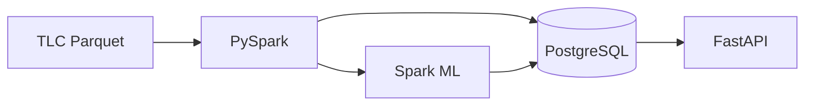
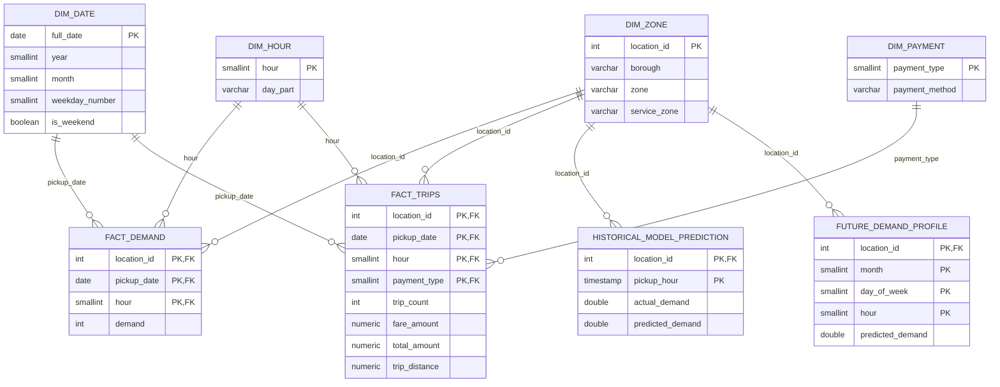
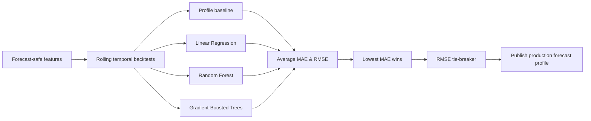

# Backend

The backend transforms raw taxi records into analytical tables, model outputs and API responses.

## Data Processing & Storage

**PySpark** handles cleaning, feature preparation and aggregation because the trip data is large enough to benefit from distributed DataFrame processing. **PostgreSQL** stores structured analytics and serving tables; the same relational model is published to **Supabase PostgreSQL** for the hosted application. Repository modules isolate SQL access from the API and frontend.

## Data Model

Supporting tables store pipeline state, model metrics, feature importance and forecast metadata.

## Machine Learning

The project separates two prediction problems.

**Historical evaluation** asks how well demand can be predicted when prior observed demand is available. It can therefore use calendar features, lagged demand and rolling statistics. A persistence baseline and Random Forest are evaluated on a chronological holdout.

**Future forecasting** must work for dates where demand has not yet been observed. Its features are restricted to calendar information and historical demand profiles to prevent leakage.

### Future Model Selection

The latest time periods are used as rolling holdouts. Every candidate is trained only on earlier observations and evaluated on the following holdout period. Metrics are averaged across the backtests. The candidate with the lowest average **MAE** becomes the production model; **RMSE** breaks a tie. Selection is therefore based on out-of-time performance rather than model complexity.

**Spark ML** is used for the trainable models so feature engineering and modelling stay in the same scalable processing ecosystem.

## FastAPI & Testing

**FastAPI** provides a lightweight service layer over published PostgreSQL results. Forecast requests read precomputed serving profiles instead of launching Spark or retraining a model, keeping interactive requests fast.

**pytest** validates forecast-safe feature logic, scoring-grid completeness, leakage protection, model selection and API health. Spark tests use small synthetic DataFrames so the suite remains practical for local execution and CI.
