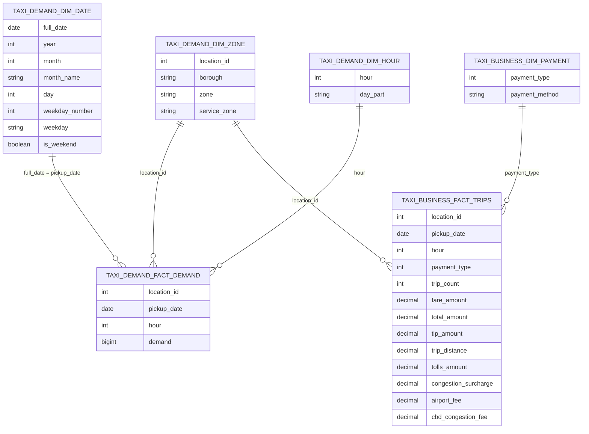

# PostgreSQL analytical and serving model

## Purpose and evidence boundary

PostgreSQL is the runtime analytical store for demand exploration and business
insights. FastAPI queries two schemas: `taxi_demand` and `taxi_business`.

The model below is derived strictly from loader column selections and SQL
queries. Logical relationships are verified by joins. Database DDL is managed
outside this repository, so the diagrams describe the application contract
rather than asserting physical keys, constraints, or indexes.

## Logical entity relationships

Cardinalities express the intended analytical relationship visible in the
queries. They do not assert that PostgreSQL foreign-key constraints exist.

## `taxi_demand` schema

The demand schema is a small star model optimized for grouping a complete
hourly demand panel by location and time attributes.

### `taxi_demand.fact_demand`

**Logical grain:** one pickup taxi zone × calendar date × hour.

| Column | Meaning | Verified source |
|---|---|---|
| `location_id` | Pickup taxi-zone identifier | `LocationID` in the prepared demand file |
| `pickup_date` | Calendar date of pickup hour | Prepared `date` |
| `hour` | Hour of day, 0–23 | Prepared `hour` |
| `demand` | Count of cleaned pickups in that zone-hour | Zero-completed hourly target |

Because the upstream pipeline constructs a full zone-hour grid, rows with
`demand = 0` are meaningful observations rather than absent records. The
committed source covers 265 zones, 181 dates, and all 24 hours, totaling
1,151,160 fact rows if loaded without loss.

### `taxi_demand.dim_zone`

| Column | Meaning |
|---|---|
| `location_id` | NYC TLC taxi-zone ID |
| `borough` | Borough label from the lookup |
| `zone` | Taxi-zone label |
| `service_zone` | TLC service-zone category |

The loader deduplicates on `location_id` and sorts it before insertion. This
dimension is shared across both schemas: business zone queries join
`taxi_business.fact_trips.location_id` to this table.

### `taxi_demand.dim_date`

| Column | Meaning |
|---|---|
| `full_date` | Date represented by the row |
| `year` | Calendar year |
| `month` | Month number |
| `month_name` | Full month name generated by Pandas |
| `day` | Day of month |
| `weekday_number` | Monday = 1 through Sunday = 7 |
| `weekday` | English weekday name |
| `is_weekend` | True for weekday numbers 6 and 7 |

The source extract already contains weekday number/name; the loader derives
the remaining calendar attributes. Demand queries join `pickup_date` to
`full_date` for weekday aggregations.

### `taxi_demand.dim_hour`

| Column | Meaning |
|---|---|
| `hour` | Integer hour 0–23 |
| `day_part` | `Night`, `Morning`, `Afternoon`, or `Evening` |

Day parts are assigned as 00:00–05:59 Night, 06:00–11:59 Morning,
12:00–17:59 Afternoon, and 18:00–23:59 Evening. Current API queries join this
dimension to obtain/order the hour, but do not expose `day_part`.

## `taxi_business` schema

This schema supports commercial analysis without serving individual trip
records. Its fact is aggregated offline, substantially reducing database row
volume and avoiding repeated scans of the raw trip dataset.

### `taxi_business.fact_trips`

**Logical grain:** pickup taxi zone × pickup date × pickup hour × payment type.

| Column | Aggregation represented |
|---|---|
| `location_id` | Grouping key derived from `PULocationID` |
| `pickup_date` | Grouping date |
| `hour` | Grouping hour, 0–23 |
| `payment_type` | TLC payment code retained by the cleaning workflow |
| `trip_count` | Count of cleaned trips in the group |
| `fare_amount` | Sum of fare amount |
| `total_amount` | Sum of total passenger amount |
| `tip_amount` | Sum of recorded tip amount |
| `trip_distance` | Sum of trip distance |
| `tolls_amount` | Sum of tolls |
| `congestion_surcharge` | Sum of congestion surcharge |
| `airport_fee` | Sum of source `Airport_fee` |
| `cbd_congestion_fee` | Sum of CBD congestion fee |

The loader casts the three grouping IDs to small integer-compatible Spark
types, `trip_count` to integer, and the additive measures to
`decimal(14,2)` before conversion to Pandas. These casts describe the values
sent to PostgreSQL; without DDL they do not prove the physical column types.

### `taxi_business.dim_payment`

The query layer verifies two columns:

| Column | Meaning |
|---|---|
| `payment_type` | Payment code joined to the fact |
| `payment_method` | Human-readable payment label returned by the API |

The repository contains neither a loader nor seed data for this table.
Although the business-cleaning workflow retains codes 1 through 5 and the tip
queries identify code 1 as credit card, no additional code-to-label mapping
should be inferred here.

## Query patterns and metric semantics

### Demand analytics

The SQL repository calculates:

- average and total demand by hour across all fact rows;
- average and total demand by weekday;
- total demand per date;
- total and average hourly demand by zone; and
- the same temporal summaries for a selected zone and optional date bounds.

`AVG(f.demand)` averages zero-filled zone-hour observations at the grouping
level. `SUM(f.demand)` reconstructs cleaned pickup counts.

### Business analytics

The business repository calculates metrics from additive fact columns:

- total trips and monetary totals;
- average trip distance as `SUM(trip_distance) / SUM(trip_count)`;
- revenue and tips by date;
- fare totals and average fare per trip by zone;
- payment shares using grouped trip counts; and
- tip metrics restricted to `payment_type = 1` (credit-card trips).

The credit-card restriction is important because the source's recorded tips
are not treated as comparable across every payment method. Zone business
queries enrich facts through the cross-schema `taxi_demand.dim_zone` table.

The repository also defines `get_trip_distance_analysis()`, which bands the
**aggregated** `trip_distance` value stored on each fact row. This function is
not exposed by FastAPI. Because the fact column is a group sum rather than an
individual trip distance, its bands do not represent trip-level distance
distribution and should not be presented as such.

## Refresh behavior

The demand loader truncates `fact_demand`, `dim_hour`, `dim_date`, and
`dim_zone` in one transaction, then appends reconstructed Pandas DataFrames.
The business loader separately truncates `fact_trips` before inserting its
aggregate. This is full replacement, not incremental loading.

The application assumes `dim_payment` is provisioned independently. The
demand refresh also affects the zone dimension used by business queries, so
operational sequencing matters even though the repository provides no
orchestrator.

## Physical model scope

Physical schema administration sits outside the checked-in application code.
Consequently, this document does not prescribe primary or foreign keys,
uniqueness constraints, indexes, ownership, grants, exact DDL types, or
nullability. The creation and seed process for `dim_payment` is likewise not
included; only its query-facing contract is verified here.

See [Data pipeline](data_pipeline.md) for table construction and
[Architecture](architecture.md) for how FastAPI uses this model.
