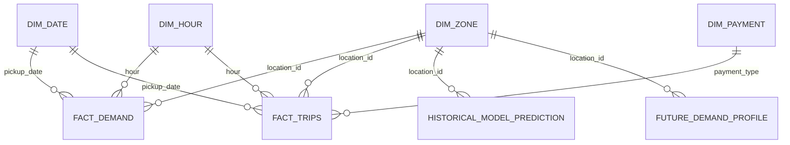

# PostgreSQL analytical and serving model

## Purpose

PostgreSQL is the runtime analytical and model-serving store. The project uses one application schema:

```text
taxi_analytics
```

The production instance is hosted on Supabase. A separate local PostgreSQL instance is used for development and publication testing.

## Core analytical relationships



## Shared dimensions

### `taxi_analytics.dim_zone`

Primary key: `location_id`. Columns include `location_id`, `borough`, `zone` and `service_zone`.

### `taxi_analytics.dim_date`

Primary key: `full_date`. Includes year, month, day, weekday and weekend attributes.

### `taxi_analytics.dim_hour`

Primary key: `hour`, constrained to 0–23.

### `taxi_analytics.dim_payment`

Primary key: `payment_type`.

## Analytical facts

### `taxi_analytics.fact_demand`

Grain: pickup zone × calendar date × hour. Composite primary key: `(location_id, pickup_date, hour)`.

### `taxi_analytics.fact_trips`

Grain: pickup zone × date × hour × payment type. Composite primary key: `(location_id, pickup_date, hour, payment_type)`.

### `taxi_analytics.pipeline_runs`

Records monthly pipeline execution state and allows the incremental workflow to determine the next expected TLC month.

## Historical model-serving tables

### `taxi_analytics.historical_model_metric`

Stores the historical evaluation metrics per model:

- `model` — primary key
- `mae`
- `rmse`
- `trained_through`
- `generated_at`

### `taxi_analytics.historical_feature_importance`

Stores Random Forest feature importance:

- `feature` — primary key
- `importance`
- `trained_through`
- `generated_at`

Importance is constrained to non-negative values.

### `taxi_analytics.historical_model_prediction`

Stores the historical test-period prediction snapshot:

- `location_id`
- `pickup_hour`
- `actual_demand`
- `predicted_demand`
- `trained_through`
- `generated_at`

Primary key: `(location_id, pickup_hour)`. `location_id` references `dim_zone` and demand values are constrained to non-negative values.

The validated May 2026 snapshot contains **197,160 prediction rows** and is trained through `2026-05-31 23:00:00`.

## Future forecast-serving tables

### `taxi_analytics.future_demand_profile`

Stores the production long-horizon demand profile at `location_id × day_of_week × hour` with predicted demand. The validated snapshot through May 2026 contains **41,604 rows**.

### `taxi_analytics.future_model_metric`

Stores aggregate rolling-backtest metrics for candidate future models.

| Model | MAE | RMSE | Backtest months |
|---|---:|---:|---:|
| `zone_dow_hour_mean` | 6.4030 | 16.0399 | 4 |
| `random_forest` | 7.3245 | 19.7391 | 4 |

### `taxi_analytics.future_forecast_metadata`

Stores the active future-serving snapshot metadata including production model, trained-through timestamp, generation timestamp, profile dimensions and row count.

## Publication behavior

Historical and future publication use snapshot-replacement strategies. Each publisher writes its snapshot transactionally to each configured PostgreSQL target:

1. local PostgreSQL
2. Supabase PostgreSQL

Historical publication replaces metrics, feature importance and historical predictions. Future publication replaces profiles, model metrics and metadata.

FastAPI reads production analytical and model-serving data directly from Supabase through its database connection.

## Query semantics

- Demand queries aggregate `fact_demand` by hour, weekday, date and zone.
- Business queries aggregate additive measures from `fact_trips` and enrich results with dimensions.
- `/data-range` derives current minimum and maximum demand dates from the database.
- Historical evaluation endpoints read historical metrics, feature importance and predictions from the historical serving tables.
- Future predictions query `future_demand_profile` and use exact or zone-level fallbacks.
- Future model validation reads `future_model_metric`.
- Future serving freshness is determined from `future_forecast_metadata`.

The database is a reduced analytical/serving model, not a raw trip store.

For construction lineage see [Data pipeline](data_pipeline.md), and for model semantics see [Forecasting](forecasting.md).
