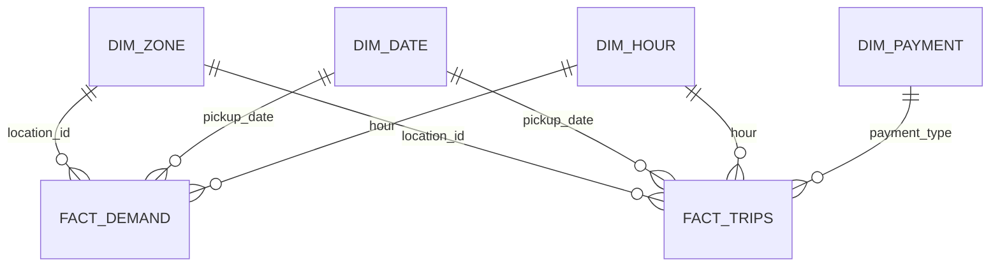

# PostgreSQL analytical and serving model

## Purpose

PostgreSQL is the runtime analytical store for demand exploration and business
insights. The current implementation uses one schema:

`taxi_analytics`

The schema is defined in
`backend/sql/create_taxi_analytics_schema.sql`.

## Entity relationships



The checked-in DDL explicitly defines primary keys, foreign keys, and basic
check constraints.

## Shared dimensions

### `taxi_analytics.dim_zone`

Primary key: `location_id`

Columns:

- `location_id`
- `borough`
- `zone`
- `service_zone`

### `taxi_analytics.dim_date`

Primary key: `full_date`

Columns:

- `full_date`
- `year`
- `month`
- `month_name`
- `day`
- `weekday_number`
- `weekday`
- `is_weekend`

The DDL enforces month values 1–12 and weekday numbers 1–7.

### `taxi_analytics.dim_hour`

Primary key: `hour`

Columns:

- `hour`
- `day_part`

The DDL enforces hour values 0–23.

### `taxi_analytics.dim_payment`

Primary key: `payment_type`

The business loader seeds:

| payment_type | payment_method |
|---:|---|
| 1 | Credit card |
| 2 | Cash |
| 3 | No charge |
| 4 | Dispute |
| 5 | Unknown |
| 6 | Voided trip |

## Demand fact

### `taxi_analytics.fact_demand`

**Grain:** one pickup zone × calendar date × hour.

Composite primary key:

```text
(location_id, pickup_date, hour)
```

Foreign keys reference `dim_zone`, `dim_date`, and `dim_hour`.

The DDL also enforces `demand >= 0`.

Because the upstream pipeline constructs a complete zone-hour grid,
zero-demand rows are meaningful observations rather than missing data.

## Business fact

### `taxi_analytics.fact_trips`

**Grain:** one pickup zone × pickup date × hour × payment type.

Composite primary key:

```text
(location_id, pickup_date, hour, payment_type)
```

Foreign keys reference `dim_zone`, `dim_date`, `dim_hour`, and `dim_payment`.

The fact stores:

- `trip_count`
- `fare_amount`
- `total_amount`
- `tip_amount`
- `trip_distance`
- `tolls_amount`
- `congestion_surcharge`
- `airport_fee`
- `cbd_congestion_fee`

## Validated serving volumes

| Table | Rows |
|---|---:|
| `dim_zone` | 265 |
| `dim_date` | 181 |
| `dim_hour` | 24 |
| `dim_payment` | 6 |
| `fact_demand` | 1,151,160 |
| `fact_trips` | 783,969 |

These counts describe the validated January–June 2025 project dataset rather
than schema-level constraints.

## Query semantics

Demand queries aggregate `fact_demand` by hour, weekday, date, and zone.
Business queries aggregate additive measures from `fact_trips` and enrich
results through shared dimensions.

The database is a serving model, not a raw trip store.

## Refresh behavior

`backend/workflows/data_pipeline.py` owns the destructive refresh step. It
truncates all six analytical tables before invoking the two loaders.

The demand loader loads shared dimensions plus `fact_demand`; the business
loader loads `dim_payment` plus `fact_trips`.

This is a full replacement strategy, not incremental loading.

For construction lineage see [Data pipeline](data_pipeline.md).
