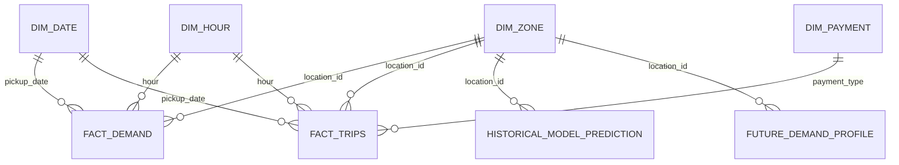

# PostgreSQL analytical and serving model

## Purpose

PostgreSQL is the runtime analytical and model-serving store under the `taxi_analytics` schema. Supabase hosts production; a separate local PostgreSQL instance is used for development and publication validation.

## Core analytical relationships



## Shared dimensions

- `dim_zone` — taxi-zone identity and descriptive attributes
- `dim_date` — calendar attributes
- `dim_hour` — hour and day part
- `dim_payment` — payment method

## Analytical facts

- `fact_demand` grain: pickup zone × calendar date × hour
- `fact_trips` grain: pickup zone × date × hour × payment type
- `pipeline_runs` records monthly pipeline state and determines the next expected TLC month

## Historical model-serving tables

### `historical_model_metric`
Stores MAE/RMSE per historical model plus training and generation timestamps.

### `historical_feature_importance`
Stores non-negative Random Forest feature importance plus snapshot timestamps.

### `historical_model_prediction`
Stores `location_id`, `pickup_hour`, actual demand, predicted demand and snapshot timestamps. Primary key: `(location_id, pickup_hour)`.

The validated May 2026 snapshot contains **197,160 prediction rows** and is trained through `2026-05-31 23:00:00`.

## Future forecast-serving tables

### `future_demand_profile`

Grain:

```text
location_id × month × day_of_week × hour
```

Columns:

- `location_id` — foreign key to `dim_zone`
- `month` — 1–12
- `day_of_week` — Spark weekday 1–7
- `hour` — 0–23
- `predicted_demand` — non-negative production forecast

Composite primary key: `(location_id, month, day_of_week, hour)`.

The month dimension was added so the selected production model can preserve seasonal effects while FastAPI continues to serve lightweight database lookups rather than loading Spark at request time. Existing three-dimensional profile tables are migrated automatically before the next snapshot publication.

### `future_model_metric`

Stores aggregate temporal-backtest MAE/RMSE and holdout-month count for all future candidates:

- `zone_dow_hour_mean`
- `linear_regression`
- `random_forest`
- `gradient_boosted_trees`

Rows are ordered by MAE, then RMSE when served. The best validation result determines the production model automatically.

### `future_forecast_metadata`

Stores the active production model, trained-through timestamp, generation timestamp, profile dimensions and row count.

## Publication behavior

Historical and future publishers replace their serving snapshots transactionally in each configured PostgreSQL target:

1. local PostgreSQL
2. Supabase PostgreSQL

The future profile publisher inserts rows in small batches to make the larger month-aware snapshot robust over remote Supabase connections. Spark is stopped after prediction materialisation and before long SQL uploads.

## Query semantics

- Demand queries aggregate `fact_demand` by hour, weekday, date and zone.
- Business queries aggregate `fact_trips` and enrich results with dimensions.
- `/data-range` derives current coverage from the database.
- Historical evaluation endpoints read metrics, importance and predictions from historical serving tables.
- `/future-model-metrics` returns all current future-model validation results.
- `/predict` uses zone + month + weekday + hour for an exact future lookup, followed by progressively broader fallbacks.
- Future-serving freshness and active model identity come from `future_forecast_metadata`.

The database is a reduced analytical/serving model, not a raw trip store.

For construction lineage see [Data pipeline](data_pipeline.md), and for model semantics see [Forecasting](forecasting.md).
