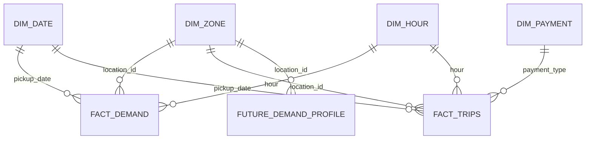

# PostgreSQL analytical and serving model

## Purpose

PostgreSQL is the runtime analytical and future-forecast serving store. The project uses one application schema:

```text
taxi_analytics
```

The production instance is hosted on Supabase. A separate local PostgreSQL instance is used for development and local publication testing.

## Core analytical relationships



## Shared dimensions

### `taxi_analytics.dim_zone`

Primary key: `location_id`

Columns include:

- `location_id`
- `borough`
- `zone`
- `service_zone`

The numeric `LocationID` is an internal key. User-facing Streamlit controls present readable taxi-zone names; for example, LocationID `161` is **Midtown Center**.

### `taxi_analytics.dim_date`

Primary key: `full_date`

Includes year, month, day, weekday and weekend attributes.

### `taxi_analytics.dim_hour`

Primary key: `hour`, constrained to 0–23.

### `taxi_analytics.dim_payment`

Primary key: `payment_type`.

Payment mapping:

| Code | Method |
|---:|---|
| 1 | Credit card |
| 2 | Cash |
| 3 | No charge |
| 4 | Dispute |
| 5 | Unknown |
| 6 | Voided trip |

## Demand fact

### `taxi_analytics.fact_demand`

Grain:

```text
pickup zone × calendar date × hour
```

Composite primary key:

```text
(location_id, pickup_date, hour)
```

The upstream pipeline constructs a complete zone-hour panel, so zero-demand rows are meaningful observations rather than missing records.

## Business fact

### `taxi_analytics.fact_trips`

Grain:

```text
pickup zone × date × hour × payment type
```

Composite primary key:

```text
(location_id, pickup_date, hour, payment_type)
```

The fact contains trip count and additive fare, total, tip, distance, toll and congestion-related measures.

## Incremental pipeline state

### `taxi_analytics.pipeline_runs`

This table records monthly pipeline execution state and allows the incremental workflow to determine the last successfully processed TLC month and therefore the next expected month.

It is part of the data-engineering control layer rather than an end-user analytical fact.

## Future forecast serving tables

### `taxi_analytics.future_demand_profile`

Stores the production long-horizon demand profile at:

```text
location_id × day_of_week × hour
```

with `predicted_demand` for each profile row.

The validated snapshot through May 2026 contains **41,604 rows**.

### `taxi_analytics.future_model_metric`

Stores aggregate rolling-backtest metrics for candidate future models.

Validated values:

| Model | MAE | RMSE | Backtest months |
|---|---:|---:|---:|
| `zone_dow_hour_mean` | 6.4030 | 16.0399 | 4 |
| `random_forest` | 7.3245 | 19.7391 | 4 |

### `taxi_analytics.future_forecast_metadata`

Stores the active future-serving snapshot metadata, including:

- production model
- trained-through timestamp
- generation timestamp
- profile dimensions
- profile row count

Validated production metadata uses:

```text
production_model = zone_dow_hour_mean
trained_through = 2026-05-31 23:00:00
profile_rows = 41604
```

## Publication behavior

Future forecast publication uses a snapshot-replacement strategy. The publisher computes the profile, metrics and metadata in memory and writes them transactionally to each configured PostgreSQL target.

The same future snapshot is published to:

1. local PostgreSQL
2. Supabase PostgreSQL

FastAPI reads the production future forecast directly from Supabase through its database connection.

## Query semantics

- Demand queries aggregate `fact_demand` by hour, weekday, date and zone.
- Business queries aggregate additive measures from `fact_trips` and enrich results with dimensions.
- `/data-range` derives current minimum and maximum demand dates from the database.
- Future predictions query `future_demand_profile` and use exact or zone-level fallbacks.
- Future model validation reads `future_model_metric`.
- Future serving freshness is determined from `future_forecast_metadata`.

The database is a reduced analytical/serving model, not a raw trip store.

For construction lineage see [Data pipeline](data_pipeline.md), and for model semantics see [Forecasting](forecasting.md).
