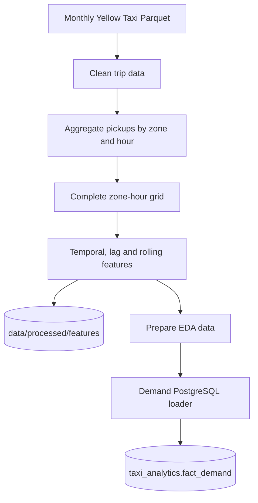

# Data pipeline

## Scope

The project processes NYC TLC Yellow Taxi monthly trip data. The currently validated analytical range is **January 2025 through May 2026**. Raw-scale transformation and ML training happen offline; FastAPI and Streamlit consume PostgreSQL/Supabase serving tables.

## Orchestration modes

```text
python -m backend.workflows.data_pipeline
python -m backend.workflows.ml_pipeline
python -m backend.workflows.run_pipeline
```

The Airflow DAG `nyc_taxi_monthly_ingestion` runs daily but processes at most one newly available TLC month. If the next month is unavailable, the run succeeds as a no-op and ML retraining is skipped.

## Inputs

| Input | Expected location | Use |
|---|---|---|
| `yellow_tripdata_YYYY-MM.parquet` | `data/raw/` | NYC Yellow Taxi trip facts |
| `taxi_zone_lookup.csv` | `data/raw/` | Taxi-zone metadata |

## Demand pipeline



The complete hourly panel includes zero-demand observations so lagged and rolling features represent real elapsed hours.

## Business pipeline

The business pipeline cleans the shared trip source, derives business measures, aggregates by pickup zone × date × hour × payment type and publishes `taxi_analytics.fact_trips`.

## ML pipeline

`backend/workflows/ml_pipeline.py` coordinates:

```text
train_model()
      ↓
publish_historical_model_data()
      ↓
train_future_model()
      ↓
publish_future_forecast_data()
```

### Historical publication

The historical Random Forest writes its offline outputs, then `publish_historical_model.py` publishes metrics, feature importance and the historical prediction snapshot to local PostgreSQL and Supabase. The validated May 2026 snapshot contains **197,160 historical prediction rows**.

### Future model selection and publication

`train_future_model.py` performs rolling temporal backtesting over the latest four available months. It compares the leakage-safe `zone_dow_hour_mean` baseline with Spark Linear Regression, Random Forest and Gradient-Boosted Trees using the same forecast-safe feature set and holdouts.

For each holdout month, historical aggregate features are built strictly from earlier months. Aggregate candidate results are written to `data/processed/future_model_summary.csv`; the lowest average MAE wins, with RMSE as tie-breaker.

`publish_future_forecast.py` then:

1. reads the selected model from the generated summary
2. builds historical aggregates through the latest available observation
3. constructs a scoring grid across zone × month × weekday × hour
4. fits the winning ML model when needed, or uses the baseline directly
5. clips predictions to non-negative demand
6. materialises the profile and stops Spark
7. publishes the snapshot to local PostgreSQL and Supabase

Future serving tables:

- `taxi_analytics.future_demand_profile`
- `taxi_analytics.future_model_metric`
- `taxi_analytics.future_forecast_metadata`

The future profile is month-aware, and existing profile tables are migrated automatically before publication. Database inserts use small batches for remote-publishing robustness.

## App staging assets

`data/app/` remains only for lightweight offline assets such as `zones.parquet` and EDA extracts. `prepare_app_data.py` refreshes only the taxi-zone artifact and is not part of model serving.

## Technology responsibilities

| Technology | Main responsibility |
|---|---|
| PySpark | Raw ingestion, cleaning, feature engineering, backtesting and ML training |
| Pandas | Reduced publication frames and model-selection summaries |
| SQLAlchemy | PostgreSQL/Supabase loading and runtime queries |
| Airflow | Incremental monthly scheduling and ML orchestration |

## Refresh semantics

After a new month is processed successfully:

- demand/business data are refreshed
- historical predictions, metrics and feature importance are republished
- all future candidates are re-evaluated
- the best future model is selected automatically
- the month-aware future forecast snapshot is republished
- FastAPI serves the new database state without a model-artifact Git commit
- Slack reports successful retraining/publishing

A normal daily no-op does not retrain, republish models or send a Slack success notification.

For table structure see [Data model](data_model.md). For model details see [Forecasting](forecasting.md).
