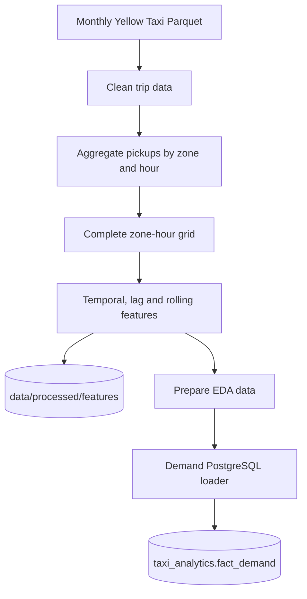
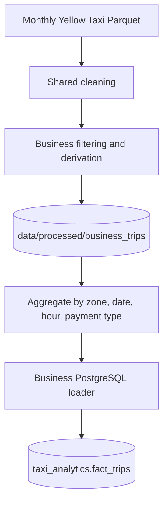

# Data pipeline

## Scope

The project processes NYC TLC Yellow Taxi monthly trip data. The currently validated analytical range is **January 2025 through May 2026**.

Two analytical domains are derived from the source data:

- hourly pickup demand and forecasting features
- business measures such as fares, total amounts, tips, distance, tolls and surcharges

Raw-scale transformation and ML training happen offline. FastAPI and Streamlit consume published database tables and reduced serving artifacts.

## Orchestration modes

The repository supports both full pipeline execution and incremental Airflow operation.

### Full pipeline entry points

```text
python -m backend.workflows.data_pipeline
python -m backend.workflows.ml_pipeline
python -m backend.workflows.run_pipeline
```

### Scheduled monthly ingestion

The Airflow DAG `nyc_taxi_monthly_ingestion` runs daily but processes at most one newly available TLC month.

```text
Airflow daily check
      ↓
Read last successful month
      ↓
Check next TLC month
   ┌──┴──────────────┐
not available      available
   ↓                  ↓
successful no-op   ingest/process/load
                      ↓
                  ML pipeline
```

This design avoids repeatedly rebuilding the full history just to discover whether TLC has published a new month.

A manual backfill DAG is also available for controlled catch-up processing.

## Inputs

| Input | Expected location | Use |
|---|---|---|
| `yellow_tripdata_YYYY-MM.parquet` | `data/raw/` | NYC Yellow Taxi trip facts |
| `taxi_zone_lookup.csv` | `data/raw/` | Taxi-zone metadata |

TLC availability is checked before attempting the next monthly ingestion.

## Demand pipeline



The complete hourly panel includes zero-demand observations so lagged and rolling features represent real elapsed hours rather than only observed pickup hours.

## Business pipeline



The business serving grain is pickup zone × date × hour × payment type.

## Analytical database publication

The production analytical schema is `taxi_analytics` and is published to PostgreSQL/Supabase.

Core tables include:

- `dim_zone`
- `dim_date`
- `dim_hour`
- `dim_payment`
- `fact_demand`
- `fact_trips`
- `pipeline_runs`

`pipeline_runs` tracks incremental ingestion state so the next expected month can be determined safely.

## ML pipeline

`backend/workflows/ml_pipeline.py` coordinates:

```text
train_model()
      ↓
prepare_app_data()
      ↓
train_future_model()
      ↓
publish_future_forecast_data()
```

### Historical Random Forest outputs

`backend/src/ml/train_model.py` writes processed historical model outputs including:

- predictions
- persisted Spark Random Forest
- feature importance
- model metrics

`prepare_app_data.py` publishes reduced historical serving files:

- `data/app/predictions.parquet`
- `data/app/zones.parquet`
- `data/app/feature_importance.csv`
- `data/app/model_metrics.csv`

These historical artifacts intentionally remain file-based.

### Future forecast outputs

`train_future_model.py` performs rolling future-month backtesting and writes the reduced backtest result under `data/processed/`.

`publish_future_forecast_data.py` then builds the production `zone_dow_hour_mean` demand profile and publishes the snapshot to:

1. local PostgreSQL
2. Supabase PostgreSQL, when `SUPABASE_DATABASE_URL` is configured

It does **not** create `data/app/future_forecast/` files.

The validated May 2026 publication produced **41,604** future-demand profile rows and metadata with `trained_through = 2026-05-31 23:00:00`.

## Technology responsibilities

| Technology | Main responsibility |
|---|---|
| PySpark | Raw ingestion, cleaning, feature engineering, historical model training and profile preparation |
| Pandas | Reduced artifacts, backtest summaries and database publication frames |
| SQLAlchemy | PostgreSQL/Supabase loading and runtime queries |
| Airflow | Incremental monthly scheduling and ML orchestration |

## Refresh semantics

The project now has two different refresh paths.

### Database-backed analytics and future forecasts

After a new month is successfully processed and the ML pipeline completes:

- demand/business data in PostgreSQL/Supabase are refreshed
- the available data range exposed by FastAPI updates from the database
- future forecast profiles, metrics and metadata are republished to PostgreSQL/Supabase
- Render can serve the new future snapshot without committing future forecast files

### Historical file-backed model outputs

The following files remain deployment artifacts:

```text
data/app/predictions.parquet
data/app/zones.parquet
data/app/feature_importance.csv
data/app/model_metrics.csv
```

After retraining, review these files locally. If they changed and should become the deployed historical model state, commit and push them so the web deployment receives the refreshed artifacts.

This manual step is intentional to keep the historical serving layer out of Supabase storage.

For table structure see [Data model](data_model.md). For model details see [Forecasting](forecasting.md).
