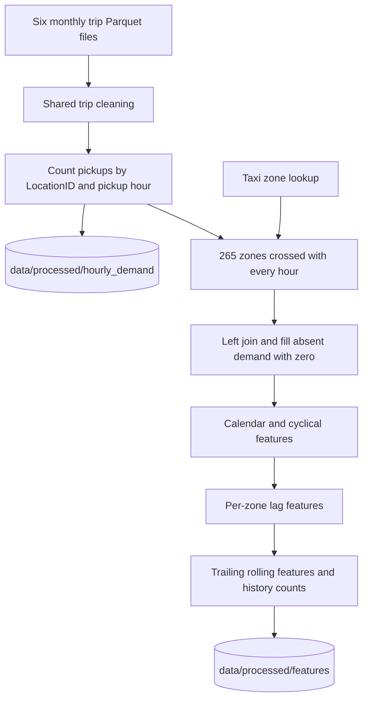
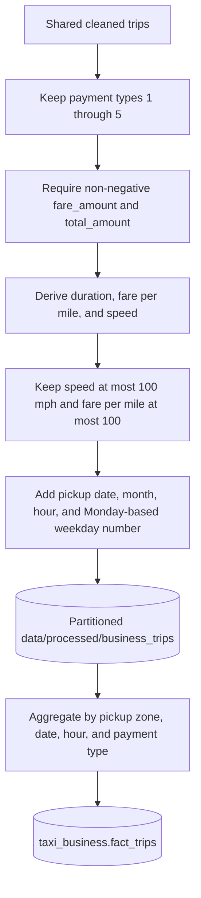

# Data pipeline

## Pipeline scope

The repository processes NYC Yellow Taxi trip records for **1 January through
30 June 2025**. It derives two serving domains from the same raw trips:

- hourly pickup demand and model features; and
- aggregated business measures such as fares, totals, tips, distance, tolls,
  and surcharges.

All raw-scale transformations are offline. FastAPI and Streamlit consume
published files and PostgreSQL tables; they never execute this pipeline.

## Inputs

| Input | Expected location | Use |
|---|---|---|
| `yellow_tripdata_2025-*.parquet` | `data/raw/` | Yellow Taxi trip facts |
| `taxi_zone_lookup.csv` | `data/raw/` | `LocationID`, borough, zone, and service-zone labels |

`load_trip_data()` sorts and reads every matching monthly file with Spark. It
raises an error if none are present. The Git ignore rules exclude the monthly
raw Parquet files, so reproducing processing requires obtaining them separately.
The zone lookup is committed and contains 265 rows.

The code does not implement downloading, source checksums, schema versioning,
or incremental ingestion. "Ingestion" here means reading files already placed
in the raw directory.

## Shared trip cleaning

Both downstream paths call `clean_trip_data()` with a half-open interval from
`2025-01-01 00:00:00` to `2025-07-01 00:00:00`.

The function performs three verified operations:

1. Retains pickups inside the six-month interval.
2. Rejects records whose drop-off timestamp precedes pickup.
3. Detects likely fare correction/reversal groups by the tuple
   `VendorID`, pickup timestamp, drop-off timestamp, pickup location, drop-off
   location, and trip distance. If a duplicated tuple contains both a negative
   and a non-negative fare, **all records matching that tuple** are removed by
   a left-anti join.

The last rule is intentionally stronger than dropping only negative rows: it
removes both sides of a suspected reversal so corrected and reversed records
do not inflate demand. The function does not otherwise deduplicate identical
positive records, validate location IDs, cap trip duration, or filter monetary
outliers; business-specific rules are applied later.

The business notebook records 24,083,384 raw rows and 23,359,857 rows after
this shared cleaning (723,527 removed, or 3.00%). These are saved notebook
outputs, not runtime monitoring metrics.

## Demand and feature pipeline

### Hourly aggregation

Pickup timestamps are truncated to an hour and cast to Spark
`timestamp_ntz`. The target column `demand` is the count of cleaned trip rows
grouped by pickup `LocationID` and hour.

### Complete zone-hour panel

The pipeline generates every hourly timestamp from `2025-01-01 00:00:00`
through `2025-06-30 23:00:00`, inclusive, cross-joins those hours with every
zone lookup row, and left-joins observed demand. Missing counts become zero.

This is important for both semantics and feature correctness: no recorded
pickup becomes a zero-demand observation, and row-offset lags correspond to
actual elapsed hours. With 265 zones and 4,344 hours, the committed daily
zone-hour serving extract contains 1,151,160 rows.

### Feature engineering

Features are built within each `LocationID` time series:

- calendar: `hour`, Spark `day_of_week`, `day_of_month`, `is_weekend`;
- cyclical: sine and cosine encodings of hour and day of week;
- lags: `lag_1h`, `lag_24h`, `lag_168h`;
- trailing means: `rolling_mean_24h`, `rolling_mean_168h`; and
- history counters: `history_count_24h`, `history_count_168h`.

Rolling windows end at the preceding row, so the current target is excluded.
History counters allow training to require a complete seven-day context. The
feature implementation uses Spark's day-of-week numbering (Sunday = 1), while
the PostgreSQL-serving extract later remaps weekdays to Monday = 1 through
Sunday = 7. These are two deliberate representations used in different
layers, not the same field definition.

See [Forecasting](forecasting.md) for training and evaluation.

## Business pipeline

The business workflow derives:

- `duration_minutes` from drop-off minus pickup;
- `fare_per_mile` only when distance is positive; and
- `speed_mph` only when duration is positive.

It retains rows where the derived values are null or at most 100, then writes
the result partitioned by pickup month. It does not require positive trip
distance, remove negative tips explicitly, or cap every individual monetary
column. Those limitations should be considered when interpreting business
aggregates.

Before PostgreSQL insertion, Spark groups the cleaned business rows by
`PULocationID`, `pickup_date`, pickup hour, and `payment_type`. It calculates
trip counts and sums eight measures, rounds monetary/numeric aggregates to two
decimal places, and casts them to match expected database types. Only this
aggregate—not the trip-level processed dataset—is converted to Pandas and
inserted into the serving table.

## Publishing demand serving data

The demand publication sequence has several explicit stages:

1. `train_model.py` reads `data/processed/features`, fits and evaluates the
   model, writes `data/processed/predictions`, and saves the Spark model.
2. `prepare_app_data.py` joins predictions to taxi-zone labels, renames demand
   to `actual_demand`, rounds the model output to `predicted_demand`, converts
   the reduced result to Pandas, and writes `data/app/predictions.parquet`. It
   also publishes `data/app/zones.parquet`.
3. `prepare_eda_data.py` reads the complete feature panel, selects demand,
   derives date/hour/weekday serving columns, joins zone labels, converts the
   result to Pandas, and writes
   `data/app/eda/zone_hour_daily.parquet`.
4. `load_demanddata_to_postgres.py` reads the zone and daily-demand files with
   Pandas, constructs three dimensions and a demand fact, truncates the four
   existing `taxi_demand` tables, and appends the refreshed data.

The demand loader assumes that the schema and tables already exist. It does
not create them.

## Pandas and PySpark responsibilities

| Technology | Verified responsibility | Rationale and trade-off |
|---|---|---|
| PySpark | Multi-file raw ingestion, cleaning joins, zone-hour expansion, feature windows, model training, business aggregation | Handles the raw-scale transformations and windowed computations; local Spark requires a JVM and substantial driver memory |
| Pandas | Feature-importance tabulation, reduced app-file writing, demand-table construction, database batch insertion, FastAPI file-backed serving | Appropriate after aggregation/reduction and simple for Parquet/CSV and SQLAlchemy integration; `toPandas()` requires the selected result to fit driver memory |

Two publication workflows convert fairly large tables to Pandas: the committed
demand database source has 1,151,160 rows and the prediction file has 190,800
rows. This simplifies creation of single Parquet files and database loading,
but is a driver-memory boundary rather than a distributed sink.

## Outputs and runtime consumers

| Output | Producer | Consumer |
|---|---|---|
| `data/processed/hourly_demand/` | `build_dataset.py` | Offline inspection; not directly used by serving |
| `data/processed/features/` | `build_dataset.py` | Training and demand EDA preparation |
| `data/processed/predictions/` | `train_model.py` | App prediction preparation |
| `data/processed/models/random_forest/` | `train_model.py` | Persisted artifact; no runtime consumer in this repository |
| `data/processed/business_trips/` | `build_business_trips.py` | Business fact loader |
| `data/app/predictions.parquet` | `prepare_app_data.py` | FastAPI, loaded into Pandas at startup |
| `data/app/zones.parquet` | `prepare_app_data.py` | EDA preparation and demand PostgreSQL loader |
| `data/app/eda/zone_hour_daily.parquet` | `prepare_eda_data.py` | Demand PostgreSQL loader only |
| `data/app/model_metrics.csv` | No checked-in writer | FastAPI at startup |
| `data/app/feature_importance.csv` | No checked-in promotion step | FastAPI at startup |
| PostgreSQL facts/dimensions | Demand and business loaders | FastAPI SQL repositories |

The model-training code writes feature importance to
`data/processed/feature_importance.csv`, not the app location. It prints but
does not write the metrics CSV. The committed app CSVs are valid serving
inputs, but their publication is not fully represented by checked-in code.

## Orchestration and refresh semantics

There is no single top-level pipeline command. A full refresh logically
requires the workflows to be invoked in dependency order, with database DDL
provisioned out of band. Both PostgreSQL loaders use destructive refresh
semantics: they truncate derived tables before inserting the replacement.
There is no incremental merge, checkpoint, retry policy, or atomic staging
table swap in the repository.

For table grains and relationships, continue to [Data model](data_model.md).
For separation from runtime deployment, see [Architecture](architecture.md)
and [Deployment](deployment.md).
