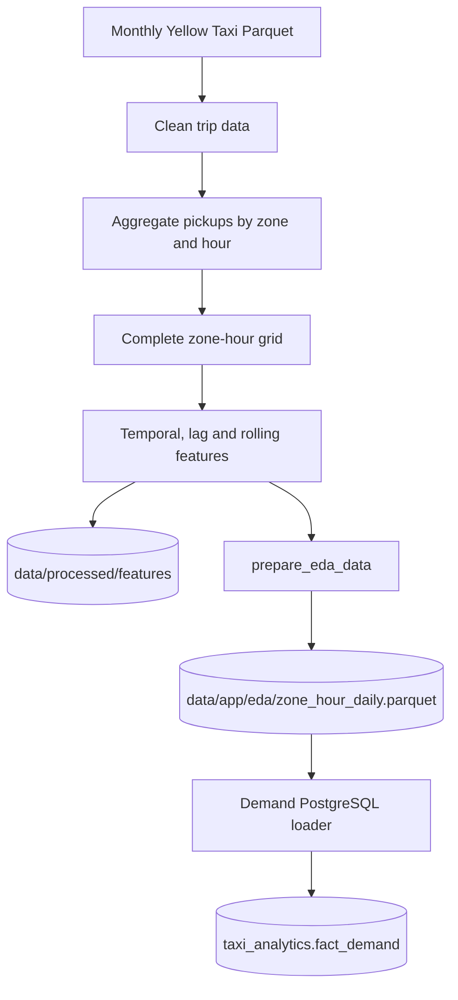
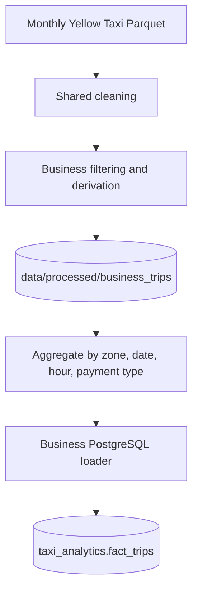

# Data pipeline

## Scope

The repository processes NYC Yellow Taxi trip records for **1 January through
30 June 2025**. It derives two analytical domains from the same source data:

- hourly pickup demand and forecasting features; and
- aggregated business measures such as fares, totals, tips, distance, tolls,
  and surcharges.

All raw-scale transformation is performed offline. FastAPI and Streamlit
consume published files and PostgreSQL tables.

## Top-level orchestration

The current pipeline hierarchy is:

```text
run_pipeline.py
├── data_pipeline.py
└── ml_pipeline.py
```

`backend/workflows/data_pipeline.py` coordinates:

```text
build_dataset
build_business_trips
prepare_eda_data
reset taxi_analytics tables
load_demanddata_to_postgres
load_businessdata_to_postgres
```

`backend/workflows/ml_pipeline.py` coordinates:

```text
train_model
prepare_app_data
```

`backend/workflows/run_pipeline.py` executes the data pipeline followed by the
ML pipeline.

The workflow package contains orchestration only. Implementation modules live
under `backend/src/`.

## Inputs

| Input | Expected location | Use |
|---|---|---|
| `yellow_tripdata_2025-*.parquet` | `data/raw/` | NYC Yellow Taxi trip facts |
| `taxi_zone_lookup.csv` | `data/raw/` | Taxi-zone metadata |

Downloading, checksums, schema versioning, and incremental ingestion are not
implemented.

## Demand pipeline



The complete hourly panel includes zero-demand observations so that lagged
features represent actual elapsed hours.

## Business pipeline



The business loader aggregates processed trips by pickup location, pickup date,
hour, and payment type, then calculates `trip_count` and additive financial and
distance measures.

## PostgreSQL publication

Before loading, `data_pipeline.py` truncates:

- `taxi_analytics.fact_demand`
- `taxi_analytics.fact_trips`
- `taxi_analytics.dim_payment`
- `taxi_analytics.dim_hour`
- `taxi_analytics.dim_date`
- `taxi_analytics.dim_zone`

Reset responsibility is centralized in the data orchestrator rather than the
individual loaders.

### Demand loader

`backend/src/database/load_demanddata_to_postgres.py` builds and loads:

- `dim_zone`
- `dim_date`
- `dim_hour`
- `fact_demand`

### Business loader

`backend/src/database/load_businessdata_to_postgres.py` reads
`data/processed/business_trips`, builds `fact_trips`, and loads `dim_payment`.

The current payment mapping is:

| Code | Method |
|---:|---|
| 1 | Credit card |
| 2 | Cash |
| 3 | No charge |
| 4 | Dispute |
| 5 | Unknown |
| 6 | Voided trip |

## ML publication

`backend/src/ml/train_model.py` writes:

- `data/processed/predictions/`
- `data/processed/models/random_forest/`
- `data/processed/feature_importance.csv`
- `data/processed/model_metrics.csv`

`backend/src/ml/prepare_app_data.py` then publishes:

- `data/app/predictions.parquet`
- `data/app/zones.parquet`
- `data/app/feature_importance.csv`
- `data/app/model_metrics.csv`

The final two files are copied from the processed directory by the checked-in
workflow.

## Technology responsibilities

| Technology | Main responsibility |
|---|---|
| PySpark | Raw ingestion, cleaning, panel construction, feature engineering, model training, business aggregation |
| Pandas | Reduced app artifacts, demand dimension/fact preparation, CSV handling |
| SQLAlchemy | PostgreSQL connection and table loading/querying |

The business aggregate and demand serving tables are converted to Pandas before
database insertion. This is a simplicity trade-off and requires the reduced
datasets to fit in local memory.

## Key outputs

| Output | Producer | Consumer |
|---|---|---|
| `data/processed/features/` | `build_dataset.py` | Model training and EDA preparation |
| `data/processed/business_trips/` | `build_business_trips.py` | Business loader |
| `data/processed/predictions/` | `train_model.py` | App-artifact preparation |
| `data/processed/models/random_forest/` | `train_model.py` | Offline persisted model |
| `data/processed/model_metrics.csv` | `train_model.py` | `prepare_app_data.py` |
| `data/processed/feature_importance.csv` | `train_model.py` | `prepare_app_data.py` |
| `data/app/predictions.parquet` | `prepare_app_data.py` | FastAPI |
| `data/app/model_metrics.csv` | `prepare_app_data.py` | FastAPI |
| `data/app/feature_importance.csv` | `prepare_app_data.py` | FastAPI |
| `data/app/eda/zone_hour_daily.parquet` | `prepare_eda_data.py` | Demand loader |
| `taxi_analytics` tables | Database loaders | FastAPI query repositories |

## Current refresh semantics

The pipeline performs a full refresh rather than an incremental merge.
Checkpointing, staging-table swaps, retry policies, and scheduled execution are
not implemented.

For table structure see [Data model](data_model.md). For model details see
[Forecasting](forecasting.md).
