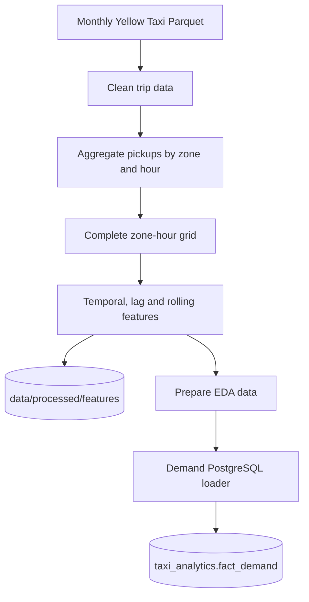
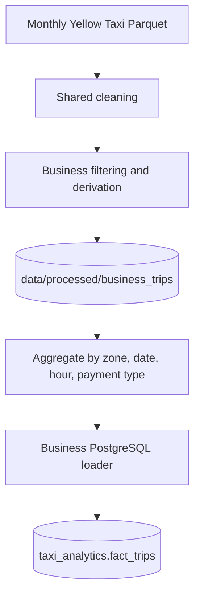

# Data pipeline

## Scope

The project processes NYC TLC Yellow Taxi monthly trip data. The currently validated analytical range is **January 2025 through May 2026**.

Raw-scale transformation and ML training happen offline. FastAPI and Streamlit consume published PostgreSQL/Supabase serving tables.

## Orchestration modes

The repository supports full pipeline execution and incremental Airflow operation.

```text
python -m backend.workflows.data_pipeline
python -m backend.workflows.ml_pipeline
python -m backend.workflows.run_pipeline
```

The Airflow DAG `nyc_taxi_monthly_ingestion` runs daily but processes at most one newly available TLC month. If the next month is unavailable, the run succeeds as a no-op and ML retraining is skipped.

## Inputs

| Input | Expected location | Use |
|---|---|---|
| `yellow_tripdata_YYYY-MM.parquet` | `data/raw/` | NYC Yellow Taxi trip facts |
| `taxi_zone_lookup.csv` | `data/raw/` | Taxi-zone metadata |

## Demand pipeline



The complete hourly panel includes zero-demand observations so lagged and rolling features represent real elapsed hours rather than only observed pickup hours.

## Business pipeline



The business serving grain is pickup zone × date × hour × payment type.

## ML pipeline

`backend/workflows/ml_pipeline.py` coordinates:

```text
train_model()
      ↓
publish_historical_model_data()
      ↓
train_future_model()
      ↓
publish_future_forecast_data()
```

### Historical Random Forest outputs and publication

`backend/src/ml/train_model.py` writes processed historical outputs including predictions, the persisted Spark Random Forest, feature importance and model metrics.

`backend/src/ml/publish_historical_model.py` builds the reduced historical serving snapshot and publishes it to:

1. local PostgreSQL
2. Supabase PostgreSQL, when `SUPABASE_DATABASE_URL` is configured

Serving tables:

- `taxi_analytics.historical_model_metric`
- `taxi_analytics.historical_feature_importance`
- `taxi_analytics.historical_model_prediction`

The validated snapshot through May 2026 contains **197,160 historical prediction rows** and has `trained_through = 2026-05-31 23:00:00`.

Historical model-serving files under `data/app/` are no longer required.

### Future forecast outputs

`train_future_model.py` performs rolling future-month backtesting. `publish_future_forecast_data.py` builds the production `zone_dow_hour_mean` demand profile and publishes the snapshot to local PostgreSQL and Supabase.

Future serving tables:

- `taxi_analytics.future_demand_profile`
- `taxi_analytics.future_model_metric`
- `taxi_analytics.future_forecast_metadata`

The validated May 2026 publication produced **41,604** future-demand profile rows and metadata with `trained_through = 2026-05-31 23:00:00`.

## App staging assets

`data/app/` remains only for lightweight offline assets such as:

- `zones.parquet`
- EDA extracts under `data/app/eda/`

`prepare_app_data.py` now refreshes only the taxi-zone Parquet artifact. It is not part of historical model serving and is not required in the monthly ML publication path.

## Technology responsibilities

| Technology | Main responsibility |
|---|---|
| PySpark | Raw ingestion, cleaning, feature engineering and ML training |
| Pandas | Reduced publication frames and backtest summaries |
| SQLAlchemy | PostgreSQL/Supabase loading and runtime queries |
| Airflow | Incremental monthly scheduling and ML orchestration |

## Refresh semantics

After a new month is successfully processed and the ML pipeline completes:

- demand/business data in PostgreSQL/Supabase are refreshed
- historical predictions, metrics and feature importance are republished
- future forecast profiles, metrics and metadata are republished
- FastAPI can serve the new database snapshots without a Git commit or application-artifact redeployment
- Slack reports successful retraining/publishing

A normal daily no-op does not retrain, republish models or send a Slack success notification.

For table structure see [Data model](data_model.md). For model details see [Forecasting](forecasting.md).
