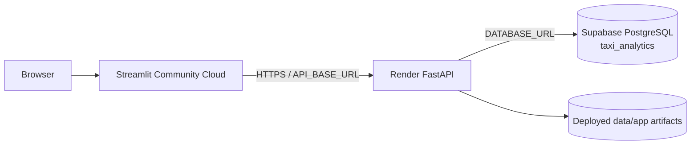

# Deployment and operations

## Deployment boundary

The project separates:

1. **offline preparation** — PySpark data processing, PostgreSQL refresh, model
   training, and artifact publication;
2. **backend serving** — FastAPI;
3. **frontend presentation** — Streamlit.

Only FastAPI and Streamlit are deployed web runtimes.

## Centralized configuration

Backend configuration lives in:

`backend/src/config/settings.py`

Frontend API configuration lives in:

`frontend/config/settings.py`

Spark-session configuration lives in:

`backend/src/ingestion/spark_session.py`

## Run the backend locally

With `DATABASE_URL` available:

```bash
uvicorn backend.serving.fast_api:app --host 127.0.0.1 --port 8000
```

FastAPI expects:

- `data/app/predictions.parquet`
- `data/app/model_metrics.csv`
- `data/app/feature_importance.csv`

Database-backed endpoints expect the `taxi_analytics` schema.

## Run the frontend locally

```bash
streamlit run frontend/streamlit_app.py
```

The local API URL defaults to:

```text
http://127.0.0.1:8000
```

The frontend does not require database credentials.

## Run the offline pipelines

The current entry points are:

```bash
python -m backend.workflows.data_pipeline
python -m backend.workflows.ml_pipeline
python -m backend.workflows.run_pipeline
```

`run_pipeline.py` is the top-level full-refresh command:

```text
Data Pipeline
    ↓
ML Pipeline
```

The data pipeline builds datasets, prepares EDA data, truncates the six
`taxi_analytics` tables, and reloads demand and business data.

The ML pipeline trains the Random Forest and publishes app-ready artifacts.

No scheduler or automated recurring execution is implemented.

## PostgreSQL provisioning

The schema DDL is checked in at:

`backend/sql/create_taxi_analytics_schema.sql`

It creates:

- `dim_zone`
- `dim_date`
- `dim_hour`
- `dim_payment`
- `fact_demand`
- `fact_trips`

with primary keys, foreign keys, and basic check constraints.

## Production topology



### Streamlit Community Cloud

The frontend runs `frontend/streamlit_app.py` and calls the deployed FastAPI
service through `API_BASE_URL`.

### Render

Render hosts `backend.serving.fast_api:app`. `DATABASE_URL` is supplied through
the deployment environment.

### Supabase

Supabase hosts the production PostgreSQL database. Streamlit does not connect
to Supabase directly.

## Environment variables

| Variable | Used by | Purpose | Default |
|---|---|---|---|
| `DATABASE_URL` | Backend and database loaders | PostgreSQL connection | none |
| `API_BASE_URL` | Frontend | FastAPI base URL | `http://127.0.0.1:8000` |
| `API_TIMEOUT` | Frontend | HTTP timeout | `60` |

Spark localhost settings are applied by the centralized Spark-session module.

## Refresh semantics

The analytical database refresh is destructive/full replacement. There is
currently no incremental merge strategy, automated scheduling, retry framework,
staging-table swap, CI/CD configuration, or infrastructure-as-code deployment.

## Runtime boundaries

The deployed runtime does not require PySpark, Java, raw TLC Parquet files, or
the persisted Spark model.

FastAPI needs the database connection and app-ready artifacts. Streamlit needs
the FastAPI endpoint.

For component responsibilities see [Architecture](architecture.md), for table
structure see [Data model](data_model.md), and for offline lineage see
[Data pipeline](data_pipeline.md).
