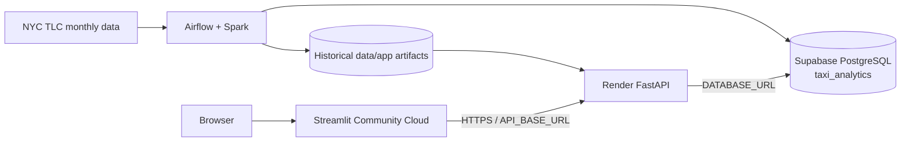

# Deployment and operations

## Deployment boundary

The project separates:

1. **offline orchestration** — Airflow, PySpark processing, database publication and ML retraining
2. **backend serving** — FastAPI on Render
3. **frontend presentation** — Streamlit Community Cloud
4. **production database** — Supabase PostgreSQL

Only FastAPI and Streamlit are web runtimes. Airflow/Spark remain outside the request path.

## Production topology



## Current production services

### Streamlit Community Cloud

Entrypoint:

```text
frontend/streamlit_app.py
```

The deployed app must use the branch containing the production code and call Render through `API_BASE_URL`.

### Render

Render hosts:

```text
backend.serving.fast_api:app
```

The backend uses Supabase for database-backed analytics and future forecast serving. It also loads the checked-in historical app artifacts.

### Supabase

Supabase hosts the production `taxi_analytics` schema. Streamlit never connects to Supabase directly.

### Airflow

Airflow currently runs locally with Docker Compose and Airflow 3.3.1. Its own PostgreSQL container is only the Airflow metadata database.

The NYC Taxi data targets are separate:

```text
Airflow metadata PostgreSQL
    → Airflow state only

Local Windows PostgreSQL
    → local NYC Taxi development/publication

Supabase PostgreSQL
    → production NYC Taxi analytical/forecast serving
```

## Environment variables

| Variable | Used by | Purpose |
|---|---|---|
| `DATABASE_URL` | Render backend / local backend | Runtime PostgreSQL connection |
| `AIRFLOW_DATABASE_URL` | Airflow project tasks | Local NYC Taxi PostgreSQL connection |
| `SUPABASE_DATABASE_URL` | Airflow/ML publisher | Production Supabase publication |
| `API_BASE_URL` | Streamlit | Render FastAPI base URL |
| `API_TIMEOUT` | Streamlit | HTTP timeout |
| `SLACK_WEBHOOK_URL` | Airflow | Pipeline notifications; configuration planned/in progress |

Secrets must not be committed. Local `.env` files and Streamlit local secrets are ignored by Git.

## Local execution

### FastAPI

```bash
uvicorn backend.serving.fast_api:app --host 127.0.0.1 --port 8000
```

### Streamlit

```bash
streamlit run frontend/streamlit_app.py
```

### Full offline pipeline

```bash
python -m backend.workflows.run_pipeline
```

### ML pipeline only

```bash
python -m backend.workflows.ml_pipeline
```

### Future forecast publisher only

```bash
python -m backend.src.ml.publish_future_forecast
```

## Airflow monthly operation

The scheduled `nyc_taxi_monthly_ingestion` DAG runs daily.

Normal behavior:

1. Read the last successfully processed TLC month.
2. Check whether the next month is available.
3. If unavailable, finish successfully without retraining.
4. If available, process at most that one month.
5. Update local PostgreSQL and Supabase analytical data.
6. Run the shared ML pipeline.
7. Publish the future forecast snapshot to local PostgreSQL and Supabase.

A successful no-op is expected behavior when TLC has not yet published the next month.

## Post-retraining manual deployment step

Future forecasts require **no manual artifact deployment** because their profiles, metrics and metadata are published directly to Supabase.

Historical model outputs are intentionally different. After successful retraining, inspect:

```text
data/app/predictions.parquet
data/app/zones.parquet
data/app/feature_importance.csv
data/app/model_metrics.csv
```

and any newly generated `data/app/eda/year=YYYY/month=MM/` files that are intended to remain checked in.

If the refreshed historical artifacts should become the deployed version:

```bash
git status
git diff --stat
git add data/app
git commit -m "Refresh app data through <month> <year>"
git push
```

Review the changes before committing. This manual step is intentional because the historical artifacts remain file-based rather than consuming additional Supabase storage.

## Future forecast production validation

After publication, verify the Supabase snapshot:

```sql
SELECT COUNT(*)
FROM taxi_analytics.future_demand_profile;

SELECT *
FROM taxi_analytics.future_model_metric
ORDER BY model;

SELECT *
FROM taxi_analytics.future_forecast_metadata
WHERE id = 1;
```

For the validated May 2026 snapshot the profile count is `41,604` and the production model is `zone_dow_hour_mean`.

Then validate Render:

```text
GET /future-model-metrics
POST /predict
```

`/predict` is a POST endpoint and requires a JSON request body.

## Data-range behavior

FastAPI exposes the current demand-data coverage from PostgreSQL through `/data-range`. Streamlit uses this endpoint for its date limits rather than hard-coded project dates.

Therefore, after a successful monthly database load, DB-backed Streamlit pages can automatically expose the newly available month.

## Slack notifications

The monthly Airflow DAG contains notification logic for:

- successful retraining after a newly processed month
- pipeline/task failures
- no Slack success message for normal daily no-op runs

The success message also reminds the operator to review and commit refreshed historical `data/app` artifacts.

To activate this feature, configure `SLACK_WEBHOOK_URL` in the Airflow Docker environment. The webhook secret must never be committed to Git. Slack setup and end-to-end notification testing should be completed before relying on these alerts operationally.

## Runtime boundaries

The deployed Render/Streamlit runtime does not require:

- PySpark
- Java
- Airflow
- raw TLC Parquet files
- the persisted Spark Random Forest model

Render needs the Supabase database connection plus the checked-in historical serving artifacts. Streamlit needs only the FastAPI endpoint.

For component responsibilities see [Architecture](architecture.md), for table structure see [Data model](data_model.md), and for pipeline lineage see [Data pipeline](data_pipeline.md).
