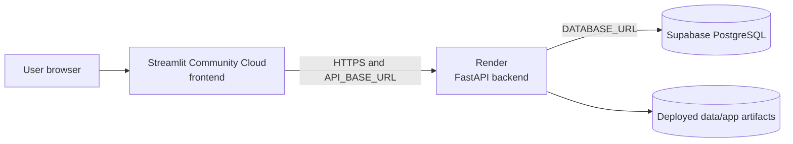

# Deployment and operations

## Deployment boundary

The repository separates three operational concerns:

1. **Offline preparation:** local PySpark workflows generate data, train the
   model, and load derived PostgreSQL tables.
2. **Backend serving:** FastAPI serves file-backed model results and
   PostgreSQL-backed analytics.
3. **Frontend presentation:** Streamlit calls FastAPI over HTTP and renders the
   interactive application.

Only the latter two are web runtimes. Rebuilding data or training a model is
not part of backend or frontend startup.

## Local development

### Dependencies

The root `requirements.txt` is an all-in-one development environment containing
Spark/data-science, backend, and frontend packages. Runtime-specific files are
also provided:

- `backend/requirements.txt`: Pandas, PyArrow, FastAPI, Uvicorn, SQLAlchemy,
  PostgreSQL driver, and dotenv support;
- `frontend/requirements.txt`: Streamlit, Requests, Pandas, Plotly, and
  ReportLab.

This separation keeps PySpark, SciPy, and scikit-learn out of the two deployed
web dependency sets. Spark ML performs training, despite scikit-learn being
present in the root environment.

Offline Spark additionally requires a compatible Java runtime and access to
the uncommitted monthly raw Parquet files. The configured Spark driver requests
8 GiB of memory and binds locally.

### Required database state

FastAPI imports the SQLAlchemy engine from `backend/src/database/connection.py`.
`DATABASE_URL` must therefore be available before the API module loads. The
database must already contain the tables expected in the `taxi_demand` and
`taxi_business` schemas, including payment lookup data. No DDL or migrations
are checked in.

### Run the backend

From the repository root, with `DATABASE_URL` set in the environment or a
local `.env` file:

```bash
uvicorn backend.serving.fast_api:app --host 127.0.0.1 --port 8000
```

The module also requires these committed paths at startup:

- `data/app/predictions.parquet`;
- `data/app/model_metrics.csv`; and
- `data/app/feature_importance.csv`.

The `/health` endpoint returns `{"status": "ok"}`, but reaching module startup
still depends on successful database-engine configuration and artifact reads.

### Run the frontend

In a separate process:

```bash
streamlit run frontend/streamlit_app.py
```

With no override, the client calls `http://127.0.0.1:8000`. Set
`API_BASE_URL` when FastAPI is hosted elsewhere. The frontend has no direct
database credential.

### Refresh data and forecasts

The repository has no unified orchestration command. The dependency order
represented by the code is:

```text
build_dataset
  ├─> train_model ─> prepare_app_data
  └─> prepare_eda_data ─> load_demanddata_to_postgres

build_business_trips ─> load_businessdata_to_postgres
```

Database schemas/tables must be provisioned separately. Metrics and
feature-importance publication into `data/app/` also requires a manual or
uncommitted step, as detailed in [Forecasting](forecasting.md#artifact-publication-boundary).

The loaders truncate and replace serving facts, so refreshes should be treated
as controlled batch operations rather than invoked from a web process.

## Production deployment

The production relationship documented by the repository is:



### Streamlit Community Cloud

The Streamlit service runs `frontend/streamlit_app.py` with the frontend
requirements. Its deployment environment supplies the Render backend URL via
`API_BASE_URL`. `API_TIMEOUT` defaults to 60 seconds, allowing an initial
request time to include backend startup latency.

The root `.streamlit/config.toml` contains application theme settings only; it
does not contain endpoint URLs or secrets. Streamlit local secrets files and
`.env` files are ignored by Git.

### Render backend

Render hosts the FastAPI application and installs the backend dependency set.
A suitable start command follows the same import target used locally, with a
platform-provided port, for example:

```bash
uvicorn backend.serving.fast_api:app --host 0.0.0.0 --port "$PORT"
```

The exact Render build/start configuration is not committed, so this command
describes the application entry point rather than a verified `render.yaml`.
Render must provide `DATABASE_URL`, and the deployment must include the
committed `data/app` model-result files.

The README notes that the free-tier backend may take approximately 50 seconds
to serve the first request after inactivity. That is expected cold-start
behavior for the selected hosting tier, not an application correctness defect.

### Supabase PostgreSQL

Supabase provides the production PostgreSQL endpoint queried by SQLAlchemy.
FastAPI performs all application database access; Streamlit does not connect
to Supabase directly. Database provisioning, access controls, and payment
dimension seed data are managed with the production database environment.

## Environment variables

| Variable | Process | Required | Purpose | Default |
|---|---|---:|---|---|
| `DATABASE_URL` | FastAPI and database-loading workflows | Yes | SQLAlchemy PostgreSQL connection URL | None |
| `API_BASE_URL` | Streamlit | No locally; required for separated cloud services | Base URL of FastAPI | `http://127.0.0.1:8000` |
| `API_TIMEOUT` | Streamlit | No | HTTP request timeout in seconds, parsed as an integer | `60` |
| `PORT` | Render start command | Platform-dependent | Port assigned to the backend service | No application-level default |

`SPARK_LOCAL_IP` is set to `127.0.0.1` by the business database-load workflow
if it is absent. Spark session code also binds the driver to localhost. These
are offline local-processing settings, not FastAPI or Streamlit configuration.

Secret values must not be committed. The Git ignore rules exclude `.env`,
`.env.*`, and `.streamlit/secrets.toml` (while permitting a future
`.env.example`, which is not currently present).

## Startup and failure behavior

- FastAPI startup fails if `DATABASE_URL` is missing because engine creation is
  import-time.
- FastAPI startup also fails if any required prediction/metadata artifact is
  absent or unreadable.
- Database-backed requests fail if PostgreSQL is unreachable or expected
  schemas/tables are missing.
- The Streamlit API client calls `raise_for_status()` and has no retry or
  circuit-breaker layer. Individual pages generally surface request failures
  through their Streamlit error handling.
- Loaded Pandas artifacts remain in the API process until it restarts; changing
  files on disk does not trigger a reload.

## Dependency and security separation

The frontend/backend split creates a useful credential boundary:

- the browser-facing Streamlit process needs only the backend URL;
- only FastAPI needs the PostgreSQL URL; and
- neither runtime needs raw taxi data, Java, or PySpark.

The application itself does not implement API authentication or authorization.
Network exposure, TLS, secret storage, and database access controls therefore
depend on the hosting platforms and are outside the checked-in implementation.

## Operational scope

Render, Streamlit Community Cloud, and Supabase deployment settings are managed
on their respective hosting platforms. Infrastructure as code, CI/CD, and
automated batch scheduling are outside the current repository scope; the
checked-in code defines the application entry points, dependencies, data
contracts, and manual refresh workflows.

For component responsibilities, see [Architecture](architecture.md). For the
database contract, see [Data model](data_model.md). For offline refresh inputs
and outputs, see [Data pipeline](data_pipeline.md).
