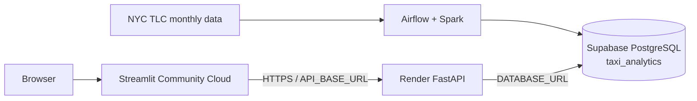

# Deployment and operations

## Deployment boundary

The project separates:

1. **offline orchestration** — Airflow, PySpark processing, database publication and ML retraining
2. **backend serving** — FastAPI on Render
3. **frontend presentation** — Streamlit Community Cloud
4. **production database** — Supabase PostgreSQL

Only FastAPI and Streamlit are web runtimes. Airflow/Spark remain outside the request path.

## Production topology



## Current production services

- **Streamlit Community Cloud** runs `frontend/streamlit_app.py`.
- **Render** hosts `backend.serving.fast_api:app`.
- **Supabase** hosts production analytical data plus historical and future model-serving snapshots.
- **Airflow** runs locally with Docker Compose and Airflow 3.3.1; its PostgreSQL container stores Airflow metadata only.

Database separation:

```text
Airflow metadata PostgreSQL → Airflow state only
Local Windows PostgreSQL   → local NYC Taxi development/publication
Supabase PostgreSQL        → production analytical/model serving
```

## Environment variables

| Variable | Used by | Purpose |
|---|---|---|
| `DATABASE_URL` | Render backend / local backend | Runtime PostgreSQL connection |
| `AIRFLOW_DATABASE_URL` | Airflow project tasks | Local NYC Taxi PostgreSQL connection |
| `SUPABASE_DATABASE_URL` | Airflow/ML publishers | Production Supabase publication |
| `API_BASE_URL` | Streamlit | Render FastAPI base URL |
| `API_TIMEOUT` | Streamlit | HTTP timeout |
| `SLACK_WEBHOOK_URL` | Airflow | Retraining success and failure notifications |
| `AIRFLOW_JWT_SECRET` | Airflow | Local Airflow API authentication JWT secret |

Secrets must not be committed. Local `.env` files and Streamlit local secrets are ignored by Git.

## Local execution

```bash
uvicorn backend.serving.fast_api:app --host 127.0.0.1 --port 8000
streamlit run frontend/streamlit_app.py
python -m backend.workflows.run_pipeline
python -m backend.workflows.ml_pipeline
python -m backend.src.ml.publish_historical_model
python -m backend.src.ml.publish_future_forecast
```

## Airflow monthly operation

The scheduled `nyc_taxi_monthly_ingestion` DAG runs daily.

Normal behavior:

1. Read the last successfully processed TLC month.
2. Check whether the next month is available.
3. If unavailable, finish successfully without retraining or a Slack success notification.
4. If available, process at most that one month.
5. Update local PostgreSQL and Supabase analytical data.
6. Retrain the historical model.
7. Publish historical predictions, metrics and feature importance to local PostgreSQL and Supabase.
8. Run future-model validation/training and publish the future forecast snapshot.
9. Send a Slack success notification after successful retraining and publication.

Pipeline/task failures trigger the configured Slack failure callback. A successful no-op intentionally remains silent in Slack.

## Model publication validation

Historical snapshot checks:

```sql
SELECT COUNT(*) FROM taxi_analytics.historical_model_metric;
SELECT COUNT(*) FROM taxi_analytics.historical_feature_importance;
SELECT COUNT(*) FROM taxi_analytics.historical_model_prediction;
SELECT MAX(pickup_hour) FROM taxi_analytics.historical_model_prediction;
```

Future snapshot checks:

```sql
SELECT COUNT(*) FROM taxi_analytics.future_demand_profile;
SELECT * FROM taxi_analytics.future_model_metric ORDER BY model;
SELECT * FROM taxi_analytics.future_forecast_metadata WHERE id = 1;
```

For the validated May 2026 historical snapshot, `historical_model_prediction` contains **197,160 rows** and is trained through `2026-05-31 23:00:00`.

For the validated May 2026 future snapshot, the profile count is **41,604** and the production model is `zone_dow_hour_mean`.

There is **no manual Git commit/deployment step for historical or future model-serving artifacts**. The publishers update PostgreSQL/Supabase directly.

## Data-range behavior

FastAPI exposes current demand-data coverage from PostgreSQL through `/data-range`. Streamlit uses this endpoint for date limits rather than hard-coded project dates.

## Slack notifications

Notification behavior:

- **new TLC month + successful ML retraining/publication** → Slack success notification
- **pipeline/task failure** → Slack failure notification with run/task context and an Airflow log URL when available
- **normal daily no-op** → no Slack message

The success notification no longer requests manual `data/app` artifact commits because model-serving snapshots are database-backed.

`SLACK_WEBHOOK_URL` is supplied through the local Airflow Docker environment and must never be committed to Git.

## Runtime boundaries

The deployed Render/Streamlit runtime does not require PySpark, Java, Airflow, raw TLC Parquet files, or the persisted Spark Random Forest model. Render needs the Supabase database connection; Streamlit needs only the FastAPI endpoint.

For component responsibilities see [Architecture](architecture.md), for table structure see [Data model](data_model.md), and for pipeline lineage see [Data pipeline](data_pipeline.md).
