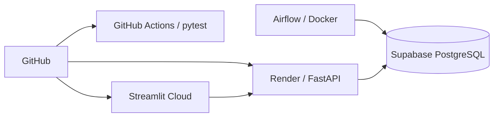

# Deployment

The hosted application separates database persistence, API serving, frontend hosting and continuous integration.

## Architecture

| Technology | Use in the project |
|---|---|
| **Supabase PostgreSQL** | Hosted analytical and model-serving database |
| **Render** | Hosts the FastAPI backend |
| **Streamlit Community Cloud** | Hosts the interactive frontend |
| **Docker Compose** | Runs the local Airflow environment consistently |
| **GitHub Actions** | Runs pytest automatically on code changes |

## Configuration & CI

Environment-specific values such as database connections, API endpoints and Slack configuration are supplied through environment variables rather than committed secrets.

GitHub Actions installs the Python dependencies and Java required by PySpark, then runs the focused pytest suite on pushes and pull requests to `main`. Tests use isolated configuration rather than production database credentials.

A TLC data refresh is handled by Airflow and the backend pipeline. Application deployment is required when code, dependencies or infrastructure configuration changes.

## Production Links

- Streamlit: https://george-nyc-taxi-analytics.streamlit.app/
- FastAPI: https://nyc-taxi-api-555f.onrender.com
