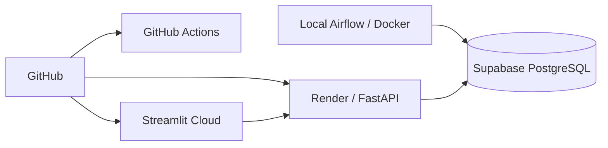

# Deployment

Production separates persistence, API serving, frontend hosting, orchestration and CI.

## Architecture

| Component | Responsibility |
|---|---|
| Supabase PostgreSQL | Hosted analytics and model-serving data |
| Render | FastAPI |
| Streamlit Community Cloud | Frontend |
| Docker Compose | Local Airflow runtime |
| GitHub Actions | Automated pytest suite |

## Configuration & CI

Secrets and environment-specific values are supplied through environment variables rather than committed files. Local development can use local PostgreSQL while hosted services use production configuration.

On pushes and pull requests to `main`, GitHub Actions installs Python dependencies and Java for PySpark, then runs pytest with isolated test configuration. Production database credentials are not required by the test suite.

## Data Refresh vs. Deployment

A successful TLC ingestion is a **data refresh**, not a code deployment. Airflow processes the new data and republishes model outputs; README and docs do not need monthly edits.

Code deployment is required only when application code, dependencies or infrastructure configuration changes.

## Production Links

- Streamlit: https://george-nyc-taxi-analytics.streamlit.app/
- FastAPI: https://nyc-taxi-api-555f.onrender.com
