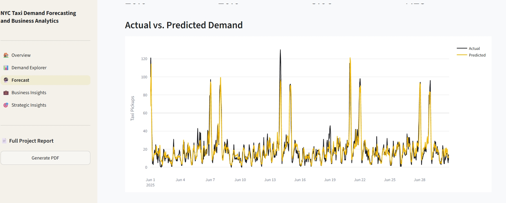

# Demand forecasting

## Forecasting task

The model estimates the number of cleaned Yellow Taxi pickups in a NYC taxi
zone during an hour. The supervised-learning target is therefore `demand` at
the **`LocationID` × `pickup_hour`** grain.

The implementation is a batch evaluation workflow. It trains on historical
observations and publishes predictions for a held-out June 2025 period. The
deployed API returns those precomputed results; it does not accept arbitrary
features, generate future lags, or invoke the saved model online.

## Modeling dataset

The underlying panel covers all 265 zone lookup rows and every hour from
1 January through 30 June 2025. Observed cleaned pickup counts are left-joined
to this panel, and absent observations are assigned zero demand. This makes
the hourly series regular and ensures row-based offsets correspond to elapsed
hours.

For modeling, demand is cast to double and rows are retained only when
`history_count_168h == 168`. The first seven days for each zone are therefore
excluded because they lack a complete trailing week.

## Features

The Spark `VectorAssembler` uses 13 columns:

| Feature | Derivation | Information represented |
|---|---|---|
| `hour` | Hour of pickup timestamp | Intraday position |
| `day_of_week` | Spark `dayofweek` (Sunday = 1) | Weekly calendar position |
| `day_of_month` | Calendar day | Within-month position |
| `is_weekend` | 1 for Sunday or Saturday | Weekend indicator |
| `hour_sin`, `hour_cos` | Sine/cosine over 24 hours | Circular intraday position |
| `dow_sin`, `dow_cos` | Sine/cosine over 7 Spark weekday values | Circular weekly position |
| `lag_1h` | Demand one row/hour earlier in the zone | Immediate history |
| `lag_24h` | Demand 24 hours earlier | Daily persistence |
| `lag_168h` | Demand 168 hours earlier | Weekly persistence |
| `rolling_mean_24h` | Mean of the preceding 24 zone rows | Recent demand level |
| `rolling_mean_168h` | Mean of the preceding 168 zone rows | Weekly demand level |

Lag and rolling windows are partitioned by zone and ordered by pickup hour.
Rolling windows end one row before the current observation, preventing direct
inclusion of the target. The code contains no categorical encoding for zone
identity and no weather, holiday, event, traffic, or destination features.
Spatial variation is represented indirectly through each zone's historical
demand values.

## Chronological validation

The production workflow uses a time split rather than random sampling:

- **training:** all eligible observations before `2025-06-01 00:00:00`;
- **test:** all eligible observations on or after that timestamp, through the
  dataset end on 30 June.

This prevents future observations from being randomly mixed into the training
partition. It is a single holdout interval, not rolling-origin cross-validation
or backtesting across multiple temporal folds.

The exploratory demand notebook also contains a smaller January prototype
split and records different prototype scores. Those notebook values are useful
development history, but the committed `data/app/model_metrics.csv` is the
authoritative artifact displayed by the application.

## Baseline and model

### Persistence baseline

The baseline predicts each test target with `lag_24h`, equivalent to using the
same zone and hour from the previous day. It sets a meaningful reference for
whether the learned model improves on daily persistence.

### Random Forest

The Spark ML `RandomForestRegressor` is configured with:

- 100 trees;
- maximum depth 10;
- random seed 42;
- `demand` as the label; and
- `prediction` as the output.

No hyperparameter search, calibration, separate preprocessing pipeline model,
or alternative production estimator is implemented.

## Evaluation results

The committed application metrics are:

| Model | MAE | RMSE |
|---|---:|---:|
| Baseline `lag_24h` | 7.16 | 23.43 |
| Random Forest | 5.01 | 16.71 |

Relative to the committed baseline, the Random Forest reduces MAE by about
30.0% and RMSE by about 28.7%. MAE expresses the average absolute error in
hourly pickups; RMSE gives more weight to large misses. RMSE is materially
higher than MAE for both methods, consistent with some errors being much
larger than the typical absolute miss. The repository does not provide
confidence intervals or a statistical significance analysis.

The committed feature-importance artifact assigns most importance to demand
history:

| Feature | Importance |
|---|---:|
| `lag_168h` | 0.405756 |
| `lag_1h` | 0.258064 |
| `lag_24h` | 0.213218 |
| `rolling_mean_24h` | 0.054306 |
| `rolling_mean_168h` | 0.038072 |

The remaining calendar and cyclical features have smaller individual values.
Spark Random Forest importance indicates model reliance, not causality.

## Persistence and publication

After fitting, the workflow writes:

- `data/processed/predictions/`, containing `LocationID`, `pickup_hour`,
  `demand`, and `prediction` as Spark Parquet;
- `data/processed/models/random_forest/`, the persisted Spark ML model; and
- `data/processed/feature_importance.csv`, calculated in Pandas.

`prepare_app_data.py` then joins prediction rows to zone metadata, renames
`demand` to `actual_demand`, rounds predictions to two decimals, converts the
result to Pandas, and writes `data/app/predictions.parquet`.

The committed app prediction file contains 190,800 records from 1–30 June
2025 with this schema:

| Column | Meaning |
|---|---|
| `LocationID` | Pickup zone ID |
| `Borough` | Lookup borough |
| `Zone` | Lookup taxi-zone name |
| `service_zone` | Lookup service-zone category |
| `pickup_hour` | Held-out hourly timestamp |
| `actual_demand` | Observed target |
| `predicted_demand` | Random Forest prediction rounded to two decimals |

### Artifact publication boundary

The final serving directory also contains `model_metrics.csv` and
`feature_importance.csv`, but the checked-in workflow has two gaps:

- training prints baseline/model metrics but does not write
  `data/app/model_metrics.csv`; and
- training writes feature importance under `data/processed/`, while no
  checked-in step copies it to `data/app/`.

These committed files are genuine inputs used by the application, but their
final promotion step is not represented in the current workflow code.

## Prediction serving

FastAPI reads all three app artifacts during module import:

- predictions into `predictions_df`;
- metrics into `metrics_df`; and
- feature importance into `feature_importance_df`.

`GET /predictions/{location_id}` filters the in-memory prediction table by zone
and optional inclusive start/end dates. It returns 404 for an unknown zone or
an empty selected period and 400 for reversed date bounds. The metrics and
importance endpoints return the entire corresponding CSV.

Streamlit obtains zone options and prediction records through its HTTP client.
The Forecast page filters the selected period and derives presentation metrics
such as selected-zone MAE/RMSE from returned actual and predicted values. The
Overview and PDF-report paths consume the aggregate CSV metrics through the
API.

The saved Spark model has no runtime consumer in the repository. Redeploying
the API with a new prediction file is the mechanism implied by the current
architecture for changing served forecasts.

## Current modeling scope

- **Temporal scope:** raw processing is hard-coded to January–June 2025, and
  the served prediction artifact covers June only.
- **Chronological holdout:** June is the single test interval rather than one
  of several rolling backtest windows.
- **Batch serving:** the API exposes predictions beside already-observed
  actuals; it does not perform online inference or live forward forecasting.
- **History dependency:** dominant features require recent observed demand and
  a complete seven-day history.
- **Feature scope:** no exogenous weather, event, holiday, traffic, or economic
  variables are used.
- **Output constraints:** a regression tree can produce non-integer values;
  the publication workflow rounds to two decimals but does not explicitly
  round to whole trips or clamp negative predictions.

For upstream construction, see [Data pipeline](data_pipeline.md). For runtime
placement, see [Architecture](architecture.md) and [Deployment](deployment.md).
