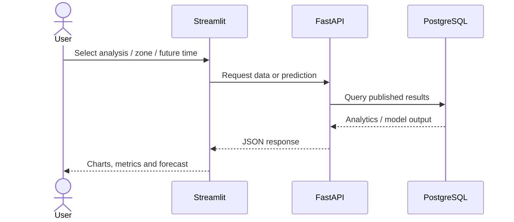

# Frontend

The Streamlit app is a lightweight presentation layer over FastAPI. It does not start Spark, train models or read large processed datasets directly.

**Live application:** https://george-nyc-taxi-analytics.streamlit.app/

## UI Flow



The application presents exploratory analytics, historical model evaluation and future-demand forecasting. Model metrics and the production-model label are read dynamically from published results rather than hard-coded into the UI.

## UI Mockup

```text
┌──────────────────────────────────────────────────────────────┐
│ NYC Yellow Taxi Analytics                                  │
├───────────────┬──────────────────────────────────────────────┤
│ Navigation    │ Main view                                    │
│               │                                              │
│ • Overview    │  KPI        KPI        KPI                    │
│ • Analytics   │ ┌────────┐ ┌────────┐ ┌────────┐             │
│ • Model       │ └────────┘ └────────┘ └────────┘             │
│ • Forecast    │                                              │
│               │  ┌────────────────────────────────────────┐  │
│ Zone / Date   │  │          Interactive chart             │  │
│ controls      │  └────────────────────────────────────────┘  │
│               │                                              │
│               │  Model metrics / forecast result             │
└───────────────┴──────────────────────────────────────────────┘
```

The mockup documents the UI structure rather than a specific data snapshot, so it remains valid as monthly data changes.
