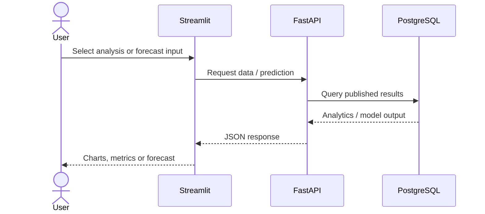

# Frontend

**Streamlit** provides the interactive analytics interface, while **Plotly** supports interactive visualisations. The frontend consumes **FastAPI** responses instead of running PySpark, training models or querying large processing datasets itself.

**Live application:** https://george-nyc-taxi-analytics.streamlit.app/

## Use Cases

- Explore taxi demand and trip behaviour across zones and time periods.
- Review historical model performance and feature importance.
- Estimate future taxi demand for a selected zone and date/time.
- Compare future-model validation results and identify the production model.
- Generate and download a PDF project report from the application.

## Request Flow



## UI Mockup — Future Demand Use Case

```text
┌────────────────────────────────────────────────────────────────┐
│ NYC Yellow Taxi Analytics                                     │
├─────────────────┬──────────────────────────────────────────────┤
│ Navigation      │ Future Demand Forecast                       │
│                 │                                              │
│ • Overview      │ Taxi zone      [ Select zone ▼ ]             │
│ • Analytics     │ Forecast date  [ Select date ]               │
│ • Model         │ Forecast time  [ Select time ]   [Forecast]  │
│ • Forecast      │                                              │
│                 │ ┌──────────────────────────────────────────┐ │
│ [PDF Report]    │ │           Predicted demand             │ │
│                 │ │          Forecast method               │ │
│                 │ └──────────────────────────────────────────┘ │
│                 │                                              │
│                 │ Model Validation                             │
│                 │ ┌──────────────────────────────────────────┐ │
│                 │ │ Model       MAE       RMSE      Status  │ │
│                 │ │ ...         ...       ...       ...     │ │
│                 │ └──────────────────────────────────────────┘ │
└─────────────────┴──────────────────────────────────────────────┘
```

The forecast page demonstrates the main operational use case: a user chooses a future place and time, receives the stored production forecast through FastAPI, and can inspect how the candidate models were validated. The PDF report provides a portable summary of the wider project analysis.
