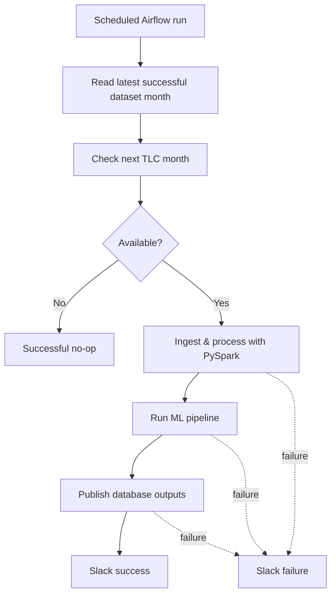

# Orchestration

**Apache Airflow** schedules and coordinates the recurring update while keeping processing logic inside reusable backend modules. **Docker Compose** provides a reproducible local Airflow runtime.

## Update Workflow

The DAG uses persisted pipeline state to determine the next dataset to check and processes at most one new month per run. Retraining occurs only after successful ingestion. If no new TLC file is available, the run finishes successfully without unnecessary ML work.

Slack provides operational feedback for successful refreshes and failures; a normal no-op does not generate a success message.

## Airflow Runtime

Docker Compose runs the Airflow API server, scheduler, DAG processor and metadata PostgreSQL database. **LocalExecutor** executes tasks locally without a Celery worker. `catchup=False` prevents scheduler downtime from generating a backlog of missed DAG runs.

The DAG invokes the same Python workflows used for manual execution, so orchestration does not duplicate ingestion or ML logic.
