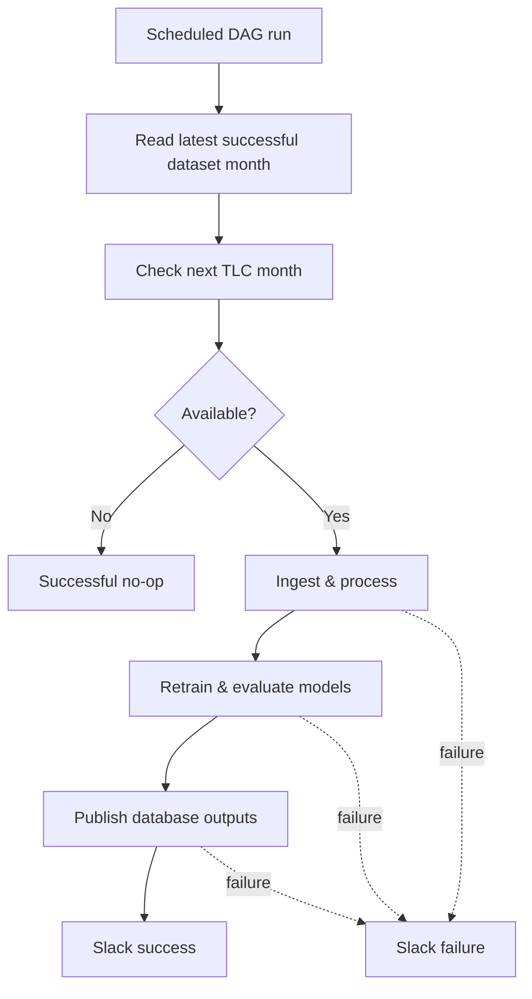

# Orchestration

Airflow controls when the backend workflows run; processing and modelling logic remain in backend modules.

## Monthly Update

The workflow is state-driven, not hard-coded to a calendar month. It processes at most one new month per run. With `catchup=False`, missed scheduler runs do not create a backlog; a later run continues from the persisted pipeline state.

Retraining happens only after successful new-data ingestion. If TLC has not published the next month, the DAG succeeds without retraining or a Slack success message.

## Runtime

Local orchestration uses Docker Compose with the Airflow API server, scheduler, DAG processor and Airflow metadata PostgreSQL database. LocalExecutor is used, so no Celery worker is required.

The DAG calls the same backend workflows available for manual execution, avoiding a second implementation of the pipeline.
